# Probabilistic Graphical Models

The key tool for probabilistic inference is the _joint probability table_. Each row in a joint probability table describes a combination of values for a set of random variables. That is, say you have $n$ events which have a binary outcome (T/F). A row would describe a unique configuration of these events, e.g. if $n=4$ then one row might be $0,0,0,0$ and another might be $1,0,0,0$ and so on.

Using a joint probability table you can learn a lot about how those events are related probabilistically.

The problem is, however, that joint probability tables can get very big. There will be $2^n$ rows (for this binary case; with more outcomes naturally leading to even bigger tables), so if you are looking at 10 events you already have 1,024 rows to consider.

We can use __probabilistic graphical models__ to reduce this space. Probabilistic graphical models allow us to represent complex networks of interrelated and independent events.

There are two main types of graphical models:

- __Bayesian models__: aka __Bayesian networks__, sometimes called _Bayes nets_ or __belief networks__. These are used when there are causal relationships between the random variables.
- __Markov models__: used when there are noncausal relationships between the random variables.

## Bayesian Networks

Say we are looking at five events:

- a dog barking ($D$)
- a raccoon being present ($R$)
- a burglar being present ($B$)
- a trash can is heard knocked over ($T$)
- the police are called ($P$)

We can encode some assumptions about how these events are related in a _belief net_ (also called a _Bayesian net_):

Every node is dependent on its parent and nothing else that is not a descendant. To put it another way: given its parent, a node is independent of all its non-descendants.

For instance, the event $P$ is dependent on its parent $D$ but not $B$ or $R$ or $T$ because their causality flows through $D$.

$D$ depends on $B$ and $R$ because they are its parents, but not $T$ because it is not a descendant or a parent. But $D$ may depend on $P$ because it is a descendant.

We can then annotate the graph with probabilities:

The $B$ and $R$ nodes have no parents so they have singular probabilities.

The others depend on the outcome of their parents.

With the belief net, we only needed to specify 10 probabilities.

If we had just constructed joint probability table, we would have had to specify $2^5=32$ probabilities (rows).

If we expand out the conditional probability of this system using the chain rule, it would look like:

$$
P(p,d,b,t,r) = P(p|d,b,t,r)P(d|b,t,r)P(b|t,r)P(t|r)P(r)
$$

But we can bring in our belief net's conditional independence assumptions to simplify this:

$$
P(p,d,b,t,r) = P(p|d)P(d|b,r)P(b)P(t|r)P(r)
$$

Belief networks are _acyclical_, that is, they cannot have any loops (a node cannot have a path back to itself).

Two nodes (variables) in a Bayes net are on an __active trail__ if a change in one node affects the other. This includes cases where the two nodes have a causal relationship, an evidential relationship, or have some common cause.

## Hidden Markov Models (HMM)

__Hidden Markov Models__ are Bayes nets in which each state $S_i$ depends only on the previous state $S_{i-1}$ (so the sequence of states is a Markov chain) and emits an observation $z_i$. It is hidden because we do not observe the states directly, but only these observations. The actual observations are stochastic (e.g. an underlying state may produce one of many observations with some probability). We try to infer the state based on these observations.

The parameters of a HMM are:

- The initial state distribution, $P(S_0)$
- The transition distribution, $P(S_2|S_1)$
- The measurement/observation distribution, $P(z_1|S_1)$

### Example

Say we have the following HMM:

We don't know the starting state, but we know the probabilities:

$$
\begin{aligned}
P(R_0) &= \frac{1}{2} \\
P(S_0) &= \frac{1}{2}
\end{aligned}
$$

Say on the first day we see that this person is happy and we want to know whether or not it is raining. That is:

$$
P(R_1|H_1)
$$

We can use Bayes' rule to compute this posterior:

$$
P(R_1|H_1) = \frac{P(H_1|R_1)P(R_1)}{P(H_1)}
$$

We can compute these values by hand:

$$
\begin{aligned}
P(R_1) &= P(R_1|R_0)P(R_0) + P(R_1|S_0)P(S_0) \\
P(H_1) & = P(H_1|R_1)P(R_1) + P(H_1|S_1)P(S_1)
\end{aligned}
$$

$P(H_1|R_1)$ can be pulled directly from the graph.

Then you can just run the numbers.

## References

- MIT 6.034 (Fall 2010): Artificial Intelligence. Patrick H. Winston.

---

## Graphs

A directed graph:

An undirected graph:

A _path_ $A \to B$ is the sequenceo f nodes connecting $A$ to $B$, including $A$ and $B$.

Here the path $A \to B$ is $A,C,E,B$.

$A,C,E$ are the _ancestors_ of $B$.
$C,E,B$ are the _descendants_ of $A$.

A _cycle_ is a directed path which ends where it starts. Here, $A,D,C,B$ form a cycle.

A _loop_ is any path (directed or not) which ends where it starts.

A graph with no cycles is said to be _acyclic_.

A _chord_ is any edge which connects two non-adjacent nodes in a loop.

_Directed acyclic graphs_ (DAGs) are used often. In a DAG, _parents_ are the nodes which point to a given node; the nodes that a given node points to are its _children_. A _family_ of a node is the node and its parents.

The _Markov blanket_ of a node is its parents, children, and the parents of its children (including itself).

For an undirected graph, a node's _neighbors_ are noes directly connected to it.

In an undirected graph, a _clique_ is a fully-connected subset of nodes. All members of a clique are neighbors.

A _maximal clique_ is a clique which is not a subset of another clique.

In this graph:

- $\{A,B,C,D\}$ is a maximal clique
- $\{B,C,E\}$ is a maximal clique
- $\{A,B,C\}$ is a non-maximal clique, contained in $\{A,B,C,D\}$

An undirected graph is _connected_ if there is a path between every pair of nodes. That is, there is no isolated subgraph.

For a non-connected graph, its _connected components_ are its subgraphs which are connected.

A _singly connected graph_ is the connected graph (directed or not) where there is only one path between each pair of nodes. This is equivalent to a _tree_.

A non-singly connected graph is said to be _multiply connected_.

A _spanning tree_ of an undirected graph is one where the sum of all edge weights is at least as large as any other spanning trees'.

Graphs can be represented as an _adjacency matrix_:

$$
A =
\begin{bmatrix}
0 & 1 & 1 & 0 \\
1 & 0 & 1 & 1 \\
1 & 1 & 0 & 1 \\
0 & 1 & 1 & 0
\end{bmatrix}
$$

Where a non-zero value at $A_{ij}$ indicates that node $i$ is connected to node $j$.

A _clique matrix_ represents the maximal cliques in a graph.

For example, this clique matrix describes the following maximal clique:

$$
C =
\begin{bmatrix}
1 & 0 \\
1 & 1 \\
1 & 1 \\
0 & 1
\end{bmatrix}
$$

A clique matrix containing only 2-node cliques is an _incidence matrix_:

$$
C =
\begin{bmatrix}
1 & 1 & 0 & 0 & 0 \\
1 & 0 & 1 & 1 & 0 \\
0 & 1 & 1 & 0 & 1 \\
0 & 0 & 0 & 1 & 1
\end{bmatrix}
$$

## Belief networks

Also known as _Bayes' networks_ or _Bayesian belief networks_.

Belief networks allow you to structure (model) independence assumptions.

### Conditional independence assumptions

- Sally comes home and hears the alarm ($A=1$)
- Has she been burgled? ($B=1$)
- Or was the alarm triggered by an earthquake? ($E=1$)
- She hears on the radio that there was an earthquake ($R=1$)

We start with $P(A,B,E,R)$ and apply the chain rule of probability:

$$
P(A,B,E,R) = P(A|B,E,R) P(R|B,E) P(E|B) P(B)
$$

Then we can make some conditional independence assumptions:

* The radio report has no effect on the alarm: $P(A|B,E,R) \to P(A|B,E)$
* A burglary has no effect on the radio report: $P(R|B,E) \to P(R|E)$
* A burglary would have no effect on the earthquake: $P(E|B) \to P(E)$

Thus we have simplified the computation of the joint probability distribution:

$$
P(A,B,E,R) = P(A|B,E) P(R|E) P(E) P(B)
$$

We can also construct a belief network out of these conditional independence assumptions:

Say we are given the following probabilities:

$$
\begin{aligned}
P(B=1) &= 0.01 \\
P(E=1) &= 0.0000001 \\
P(A=1|B=1, E=1) &= 0.9999 \\
P(A=1|B=0, E=1) &= 0.99 \\
P(A=1|B=1, E=0) &= 0.99 \\
P(A=1|B=0, E=0) &= 0.0001 \\
P(R=1|E=1) &= 1 \\
P(R=1|E=0) &= 0
\end{aligned}
$$

First consider if Sally has not yet heard the radio; that is, she has only heard the alarm (so the only evidence she has is $A=1$). Sally wants to know if she's been burgled, so her question is $P(B=1|A=1)$:

$$
\begin{aligned}
P(B=1|A=1) &= \frac{P(B=1, A=1)}{P(A=1)} &\text{(Bayes' rule)} \\
&= \frac{\sum_{E,R} P(B=1,A=1,E,R)}{\sum_{B,E,R} P(B,E,A=1,R)} &\text{(marginal prob to joint prob)} \\
&= \frac{\sum_{E,R} P(A=1|B=1, E) P(B=1) P(E) P(R|E)}{\sum_{B,E,R} P(A=1|B,E) P(B) P(E) P(R|E)} &\text{(chain rule w/ our indep. assumps)} \\
&\approx 0.99
\end{aligned}
$$

Now consider that Sally has also heard the report, i.e. $R=1$. Now her question is $P(B=1|A=1, R=1)$:

$$
\begin{aligned}
P(B=1|A=1) &= \frac{P(B=1,A=1,R=1)}{P(A=1,R=1)} &\text{(Bayes' rule)} \\
&= \frac{\sum_E P(B=1,A=1,R=1,E)}{\sum_{B,E} P(A=1,R=1,B,E)} &\text{(marginal prob to joint prob)} \\
&= \frac{\sum_E P(A=1|B=1,E) P(B=1) P(E) P(R=1|E)}{\sum_{B,E}P(A=1|B,E)P(B)P(E)P(R=1|E)} &\text{(chain rule w/ our indep. assumps)} \\
&\approx 0.01
\end{aligned}
$$

So hearing the report and learning that there was an earthquake makes the burglary much less likely.

We may, however, only have _soft_ or _uncertain_ evidence.

For instance, say Sally is only 70% sure that she heard the alarm.

We denote our soft evidence of the alarm's ringing as $\tilde A = (0.7, 0.3)$, which is to say $P(A=1) = 0.7$ and $P(A=0) = 0.3$.

We're ignoring the case with the report ($R=1$) for simplicity, but with this uncertain evidence we would calculate:

$$
\begin{aligned}
P(B=1| \tilde A) &= \sum_A P(B=1|A) P(A|\tilde A) \\
&= 0.7 P(B=1|A=1) + 0.3 P(B=1|A=0)
\end{aligned}
$$

_Unreliable_ evidence is distinct from _uncertain_ evidence.

Say we represent Sally's _uncertainty_ of hearing the alarm, as described before, as $P(S|A) = 0.7$.

Now say for some reason we feel that Sally is _unreliable_ for other reasons (maybe she lies a lot). We would then replace the term $P(S|A)$ with our own interpretation $P(H|A)$. For example, if Sally tells us her alarm went off, maybe we think that means there's a 60% chance that the alarm actually went off.

This new term $P(H|A)$ is our _virtual evidence_, also called _likelihood evidence_.

### Belief networks

Formally, a belief network is a distribution of the form:

$$
P(x_1, \dots, x_D) = \prod_{i=1}^D P(x_i| \text{pa}(x_i))
$$

where $\text{pa}(x_i)$ are the _parental_ variables of variable $x$ (that is, $x$'s parents in the graph).

A belief network is a directed acyclic graph (DAG).

When you factorize a joint probability, you have a number of options for doing so.

For instance:

$$
P(x_1, x_2, x_3) = P(x_{i_1} | x_{i_2}, x_{i_3}) P(x_{i_2}| x_{i_3}) P(x_{i_3})
$$

where $(i_1, i_2, i_3)$ is any permutation of $(1,2,3)$.

Without any conditional independence assumptions, all factorizations produce an equivalent DAG.

However, once you begin dropping edges (i.e. making conditional independence assumptions), the graphs are not necessarily equivalent anymore.

Some of the graphs are equivalent; they can be converted amongst each other via Bayes' rule. Others cannot be bridged in this way, and thus are not equivalent.

Note that belief networks encode conditional independences but do not necessarily encode dependences.

For instance, the graph $a \to b$ appears to mean that $a$ and $b$ are dependent. But there may be an instance of the belief network distribution such that $p(b|a) = p(b)$; that is, $a$ and $b$ are independent. So although the DAG may seem to imply dependence, there may be cases where it in fact does not.

In these cases, we call this implied dependence _graphical dependence_.

The following belief network triple represents the conditional independence of $X$ and $Y$ given $Z$, that is $P(X,Y|Z) = P(X|Z)P(Y|Z)$.

The following belief network triple also represents the conditional independence of $X$ and $Y$ given $Z$, in particular, $P(X,Y|Z) \varpropto P(Z|X)P(X)P(Y|Z)$.

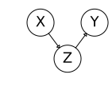

The following belief network triple represents the graphical conditional dependence of $X$ and $Y$, that is $P(X,Y|Z) \varpropto P(Z|X,Y) P(X) P(Y)$.

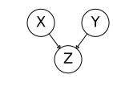

Here $Z$ is a _collider_, since its neighbors are pointing to it.

Generally, if there is a path between $X$ and $Y$ which contains a collider, and this collider is not in the conditioning set, nor are any of its descendants, we cannot induce dependence between $X$ and $Y$ from this path. We say such a path is _blocked_.

Similarly, if there is a non-collider along the path which is in the conditioning set, we cannot induce dependence between $X$ and $Y$ from this path - such a path is also said to be blocked.

If all paths between $X$ and $Y$ are blocked, we say they are _d-separated_.

However, if there are no colliders, or the colliders that are there are in the conditioning set or their descendants, and no non-collider conditioning variables in the path, we say this path _d-connects_ $X$ and $Y$ and we say they are graphically dependent.

Note that colliders are relative to a path.

For example, in the accompanying figure, $C$ is a collider for the path $A-B-C-D$ but not for the path $A-B-C-E$.

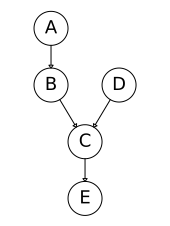

Consider the belief network $A \to B \leftarrow C$. Here $A$ and $C$ are conditionally independent. However, if we condition them on $B$, i.e. $P(A,C|B)$, then they become graphically dependent. That is, we belief the root "causes" of $A$ and $C$ to be independent, but given $B$ we learn something about both the causes of $A$ and $C$, which couples them, making them (graphically) dependent.

Note that the term "causes" is used loosely here; belief networks really only make independence statements, not necessarily causal ones.

### Properties of belief networks

A note on the following graphics: the top part shows the belief network, where a faded node means it has been marginalized out, and a filled node means it has been observed/conditioned on. The bottom part shows the relationship between $A$ and $B$ after the marginalization/conditioning.

$P(A,B,C) = P(C|A,B) P(A) P(B)$

$A$ and $B$ are independent and determine $C$.

If we marginalize over $C$ (thus "removing" it), $A$ and $B$ are made conditionally independent. That is, $P(A,B) = P(A)P(B)$.

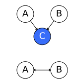

If we instead condition on $C$, $A$ and $B$ become graphically dependent. Although $A$ and $B$ are a priori independent, knowing something about $C$ tells us a bit about $A$ and $B$.

If we introduce $D$ as a child to $C$, i.e. $D$ is a descendant of a collider $C$, then conditioning on $D$ also makes $A$ and $B$ graphically dependent.

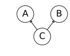

In this arrangement, $C$ is the "cause" and $A$ and $B$ are independent effects: $P(A,B,C) = P(A|C) P(B|C) P(C)$.

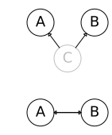

Here, marginalizing over $C$ makes $A$ and $B$ graphically dependent. In general, $P(A,B) \neq P(A)P(B)$ because they share the same cause.

Conditioning on $C$ makes $A$ and $B$ independent: $P(A,B|C) = P(A|C)P(B|C)$. This is because if you know the "cause" $C$ then you know how the effects $A$ and $B$ occur independent of each other.

The same applies for this arrangement - here $A$ "causes" $C$ and $C$ "causes" $B$. Conditioning on $C$ blocks $A$'s ability to influence $B$.

These graphs all encode the same conditional independence assumptions.

For both directed and undirected graphs, two graphs are _Markov equivalent_ if they both represent the same set of conditional independence statements.

## Graphical models

Belief networks are just one of many different _graphical probablistic models_ (PGMs).

Generally, graphical models depict independence/dependence relationships for distributions. All graphical models have some limitations in their ability to graphically express conditional (in)dependence statements.

If a model has many variables, it can get very complex, very quickly.

Typically, we have a set of random variables $x_1, \dots, x_n$ and we want to compute their probability for certain states together; that is, the joint distribution $P(x_1, \dots, x_n)$.

Even in the simple case where each random variable is binary (only two outcomes), you would still have a distribution over $2^n$ states.

Graphs allow us to manage such complexity in an efficient way, and also give us the advantage of sparse parametrization in these potentially high-dimensional distributions.

The two main classes of PGMs are:

- _Bayesian networks_, also called _belief networks_, which use directed graphs
- _Markov networks_, which use undirected graphs

### Distributions

Say we have three random variables:

- $I$, intelligence, binary: $i^0$ for low, $i^1$ for high
- $D$, difficulty of the course, binary: $d^0$ for easy, $d^1$ for hard
- $G$, grade: $g^1$ for A, $g^2$ for B, $g^3$ for C

Say we have a probability table listing out the probabilities for each combination of $I,D,G$. Cumulatively, this represents the joint distribution $P(I,D,G)$ (order of the random variables doesn't matter).

Say that we learn that a student has gotten an A,i.e. $G=g^1$. That is, now we _condition_ on $g^1$, which involves _reduction_, where we consider only the combinations of $I,D,G$ values where we fix $G=g^1$. This gives us the unnormalized measure $P(I,D, g^1)$, _not_ a probability distribution. So we must re-normalize this so that it sums to 1, giving us the probability distribution $P(I,D|g^1)$.

The process of _marginalization_ allows you to take a distribution of a set of variables and produce a distribution of a subset of those variables.

### Factors

A _factor_ is a function $\phi(X_1, \dots, X_k)$ which takes all possible combinations of outcomes (assignments) for these random variables $X_1, \dots, X_k$ and gives a real value for each combination.

The set of random variables $\{X_1, \dots, X_k\}$ is called the _scope_ of the factor.

A joint distribution is a factor which returns a number which is the probability of a given combination of assignments.

An unnormalized measure is also a factor, e.g. $P(I,D, g^1)$.

A conditional probability distribution (CPD) is also a factor, e.g. $P(G|I,D)$.

A common operation on factors is a _factor product_. Say we have the factors $\phi_1(A,B)$ and $\phi_2(B,C)$. Their factor product would yield a new factor $\phi_3(A,B,C)$. The result for a given combo $a_i, b_j, c_k$ is just $\phi_1 (a_i, b_j) \cdot \phi_2(b_j, c_k)$.

Another operation is _factor marginalization_. This is the same as marginalization for probability distributions but generalized for all factors. For example, $\phi(A,B,C) \to \phi(A,B)$.

Another operation is _factor reduction_ which is similarly is a generalization of probability distribution reduction.

### Example

Consider a joint distribution over the following random variables:

- $G$, grade: $g^1$ for A, $g^2$ for B, $g^3$ for C
- $I$, intelligence, binary: $-i$ for low, $+i$ for high
- $D$, difficulty of the course, binary: $-d$ for easy, $+d$ for hard
- $S$, SAT score, binary: $-s$ for low, $+s$ for high
- $L$, reference letter, binary: $-l$ for not received, $+l$ for received

We can encode some conditional independence assumptions about these random variables into a belief net:

- the grade depends on the student's intelligence and difficulty of the course
- the student's SAT score seems dependent on only their intelligence
- whether or not a student receives a recommendation letter depends on their grade

Note that we could add the assumption that intelligence students are likely to take more difficult courses, if we felt strongly about it:

To turn this graph into a probability distribution, we can represent each node as a CPD:

Then we can apply the _chain rule_ of Bayesian networks which just multiplies all the CPDs:

$$
P(D,I,G,S,L) = P(D) P(I) P(G|I,D) P(S|I) P(L|G)
$$

A Bayesian network (BN) is a directed acyclic graph where its nodes represent the random variables $X_1, \dots, X_n$. For each node $X_i$ we have a CPD $P(X_i | \text{Par}_G (X_i)$, where $\text{Par}_G(X_i)$ refers to the parents of $X_i$ in the graph $G$.

In whole, the BN represents a joint distribution via the chain rule for BNs:

$$
P(X_1, \dots, X_n) = \prod_i P(X_i|\text{Par}_G(X_i))
$$

We say a probability distribution $P$ _factorizes_ over a BN graph $G$ if the B chain rule holds for $P$.

There are three types of reasoning that occur with a BN:

* _Causal reasoning_ includes conditioning on an ancestor to determine a descendant's probability, e.g. $P(L=1|I=0)$.
* _Evidential reasoning_ goes the other way: given a state for a descendant, get the probability for an ancestor, e.g. $P(I=0|G=3)$.
* _Intercausal reasoning_ - consider $P(I=1|G=3,D=1)$. The $D$ node is not directly connected to the $I$ node, yet conditioning on it does affect the probability.

As the simplest example of intercausal reasoning, consider an `OR` gate:

Knowing $Y$ and $X_1$ (or $X_2$) tells you the value of $X_2$ (or $X_1$) even though $X_1$ and $X_2$ are not directly linked. Knowing $Y$ alone does not tell you anything about $X_1$ or $X_2$'s values.

There are a few different structures in which a variable $X$ can _influence_ a variable $Y$, i.e. change beliefs in $Y$ when conditioned on $X$:

- $X \to Y$
- $X \leftarrow Y$
- $X \to W \to Y$
- $X \leftarrow W \leftarrow Y$
- $X \leftarrow W \to Y$

Which the different reasonings described above capture.

The one structure which "blocks" influence is $X \to W \leftarrow Y$. That is, where two causes have a joint effect. This is called a _v-structure_.

A _trail_ is a sequence of nodes that are connected to each other by single edges in the graph. A trail $X_1 - \dots - X_k$ is _active_ (if there is no evidence) if it has no v-structures $X_{i-1} \to X_i \leftarrow X_{i+1}$, where $X_i$ is the block.

When can variable $X$ can influence a variable $Y$ given evidence $Z$?

- $X \to Y$
- $X \leftarrow Y$

$X$ may influence $Y$ given evidence $Z$ under certain conditions, depending on whether or not node $W$ is part of the evidence $Z$:

- $X \to W \to Y$, if $W \notin Z$
- $X \leftarrow W \leftarrow Y$, if $W \notin Z$
- $X \leftarrow W \to Y$, if $W \notin in Z$
- $X \to W \leftarrow Y$, if either $W \in Z$ or one of $W$'s descendants $\in Z$ (intercausal reasoning)

A trail $X_1 - \dots - X_k$ is _active_ given evidence $Z$ if, for any v-structure $X_{i-1} \to X_i \leftarrow X_{i+1}$ we have that $X_i$ or one of its descendants is in $Z$ and no other $X_i$ (not in v-structures) is in $Z$.

### Independence

For events $\alpha, \beta$, we say $P$ satisfies the independence of $\alpha$ and $\beta$, notated $P \vDash \alpha \perp \beta$ if:

- $P(\alpha,\beta) = P(\alpha)P(\beta)$
- $P(\alpha|\beta) = P(\alpha)$
- $P(\beta|\alpha) = P(\beta)$

This can be generalized to random variables:

$X, Y, P \vDash X \perp Y$ if:

- $P(X,Y) = P(X)P(Y)$
- $P(X|Y) = P(X)$
- $P(Y|X) = P(Y)$

### Conditional independence

For (sets of) random variables $X,Y,Z, P \vDash (X \perp Y | Z)$ if:

* $P(X,Y|Z) = P(X|Z) P(Y|Z)$
* $P(X|Y,Z) = P(X|Z)$
* $P(Y|X,Z) = P(Y|Z)$
* $P(X,Y,Z) \varpropto \phi_1(X,Z) \phi_2(Y,Z)$; that is, the probability of the joint distribution $P(X,Y,Z)$ is proportional to a product of the two factors $\phi_1(X,Z)$ and $\phi_2(Y,Z)$

For example:

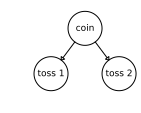

There are two coins, one is fair and one is biased to show heads 90% of the time.

You pick a coin, toss it, and it comes up heads.

The probability of heads is _higher_ in the second toss. You don't know what coin you have but heads on the first toss makes it more likely that you have the bias coin, thus a higher chance of heads on the second toss. So $X_1$ and $X_2$ are not independent. But if you know what coin you have, the tosses are then independent; the first toss doesn't tell you anything about the second anymore. That is, $X_1 \perp X_2 | C$.

But note that conditioning can also lose you independence. For example, using the previous student example, $I \perp D$, but if we condition on grade $G$, they are no longer independent (this is the same as the `OR` gate example).

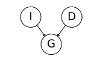

We say that $X$ and $Y$ are _d-separated_ in $G$ given $Z$ if there is no active trail in $G$ between $X$ and $Y$ given $Z$. This is notated $\text{d-sep}_G(X,Y|Z)$.

If $P$ factorizes over $G$ and $\text{d-sep}_G(X,Y|Z)$, then $P$ satisfies $X \perp Y |Z)$.

Any node is d-separated from its non-descendants given its parents.

So if a distribution $P$ factorizes over $G$, then in $P$, any variable is independent of its non-descendants given its parents.

We can notate the set of independencies implicit in a graph $G$, that is, all of the independence statements that correspond to d-separation statements in the graph $G$, as $I(G)$:

$$
I(G) = \{(X \perp Y | Z) | \text{d-sep}_G (X,Y|Z) \}
$$

If $P$ satisfies $I(G)$, then we say that $G$ is an I-map (_independency map_) of $P$.

This does not mean $G$ must imply _all_ independencies in $P$, just that those that it does imply are in fact present in $P$.

SO if $P$ factorizes over $G$, then $G$ is an I-map for $P$. The converse also holds: if $G$ is an I-map for $P$, then $P$ factorizes over $G$.

### Naive Bayes

With Naive Bayes, the class node is _hidden_ and the $X_1, \dots, X_n$ nodes are visible; they are called the _features_.

The assumption with Naive Bayes is that $(X_i \perp X_j | C)$ for all $X_i, X_j$. That is, all features are assumed to be conditionally independent given the class.

Thus we have the distribution:

$$
P(C,X_1,\dots,X_n) = P(C) \prod_{i=1}^n P(X_i|C)
$$

### Template models

Within a model you may have structures which repeat throughout or you may want to reuse common structures between/across models.

In these cases we may use _template variables_.

A template variable $X(U_1, \dots, U_k)$ is instantiated multiple times. $U_1, \dots, U_k$ are the _arguments_.

A _template model_ is a language which specifies how "ground" variables inherit dependency models from templates.

#### Temporal models

One example are _temporal models_ used for systems which evolve over time.

When representing a distribution over continuous time, you typically want to _discretize_ time so that it is not continuous. To do this, you pick a _time granularity_ $\Delta$.

We also have a set of template variables. $X^{(t)}$ describes an instance of a template variable $X$ at time $t\Delta$.

$$
X^{(t:t')} = \{X^{(t)}, \dots, X^{(t')}\} \text{where} t \leq t'
$$

That is, $X^{(t:t')}$ denotes the set of random template variables that spans these time points.

We want to represent $P(X^{(t:t')})$ for any $t, t'$.

To simplify this, we can use the _Markov assumption_, a type of conditional independence assumption.

Without this assumption, we have:

$$
P(X^{(0:T)} = P(X^{(0)}) \prod_{t=0}^{T-1} P(X^{(t+1)}|X^{(0:t)})
$$

(this is just using the chain rule for probability)

Then the Markov assumption is $(X^{(t+1)} \perp X^{(0:t-1)} | X^{(t)})$. That is, any time point is independent of the past, given the present.

So then we can simplify our distribution:

$$
P(X^{(0:T)} = P(X^{(0)}) \prod_{t=0}^{T-1} P(X^{(t+1)}|X^{(t)})
$$

The Markov assumption isn't always appropriate, or it may be too strong.

You can make it a better approximation by adding other variables about the state, in addition to $X^{(t)}$.

The second assumption we make is of _time invariance_.

We use a template probability model $P(X'|X)$ where $X'$ denotes the next time point and $X$ denotes the current time point. We assume that this model is replicated for every single time point.

That is, for all $t$:

$$
P(X^{(t+1)}|X^{(t)}) = P(X'|X)
$$

That is, the probability distribution is not influenced by the time $t$.

Again, this is an approximation and is not always appropriate. Traffic, for example, has a different dynamic depending on what time of day it is.

Again, you can include extra variables to capture other aspects of the state of the world to improve the approximation.

##### Temporal model example (transition model)

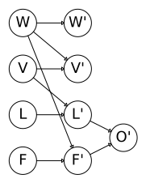

- $W$ = weather
- $V$ = velocity
- $L$ = location
- $F$ = failure
- $O$ = observation

The left column of the graph is at time slice $t$, and the right side is at time slice $t+1$.

The edges connecting the nodes at $t$ to the nodes at $t+1$, e.g. $F \to F'$, is an _inter-time-slice_, and the edges connecting nodes at $t+1$ to the observation, e.g. $F' \to O'$, are _intra-time-slices_.

We can describe a conditional probability distribution (CPD) for our prime variables as such:

$$
P(W', V', L', F', O' | W, V, L, F)
$$

We don't need a CPD for the non-prime variables because they have already "happened".

We can rewrite this distribution with the independence assumptions in the graph:

$$
P(W', V', L', F', O' | W, V, L, F) = P(W'|W) P(V'|W,V) P(L'|L,V) P(F'|F,W) P(O'|L',F')
$$

Here the observation $O'$ is conditioned on variables in the same time slice ($L', F'$) because we assume the observation is "immediate". This is a relation known as an _intra-time-slice_.

All the other variables are conditioned on the previous time slice, i.e. they are _inter-time-slice_ relations.

Now we start with some initial state (time slice 0, $t_0$):

Then we add on the next time slice, $t_1$:

And we can repeatedly do this to represent all subsequent time slices $t_2, \dots$, where each is conditioned on the previous time slice.

So we have a _2-time-slice Bayesian network_ (2TBN). A transition model (2TBN) over $X_1, \dots, X_n$ is specified as a BN _fragment_ such that:

- the nodes include $X_1', \dots, X_n'$ (next time slice $t+1$) and a subset of $X_1, \dots, X_n$ (time slice $t$).
- only the nodes $X_1', \dots, X_n'$ have parents and a CPD

The 2TBN defines a conditional distribution using the chain rule:

$$
P(X'|X) = \prod_{i=1}^n P(X_i'|\text{Pa}(X_i'))
$$

A _dynamic Bayesian network_ (DBN) over $X_1, \dots, X_n$ is defined by a:

- 2TBN $\text{BN}_{\to}$ over $X_1, \dots, X_n$
- a Bayesian network $\text{BN}^{(0)}$ over $X_1^{(0)}, \dots, X_n^{(0)}$ (time 0, i.e. the initial state)

#### Ground network

For a trajectory over $0, \dots, T$, we define a ground (unrolled network) such that:

- the dependency model for $X_1^{(0)}, \dots, X_n^{(0)}$ is copied from $\text{BN}^{(0)}$
- the dependency model for $X_1^{(t)}, \dots, X_n^{(t)}$ for all $t > 0$ is copied from $\text{BN}_{\to}$

That is, it is just an aggregate ("unrolled") of the previously shown network up to time slice $t_T$.

### Hidden Markov Models (HMMs)

HMMs can be viewed as a subclass of DBNs.

It is also a 2TBN.

It has a state variable $S$ and an observation variable $O$.

There is a transition model which tells us the transition from one state $S$ to the next $S'$.

There is also an observation model that tells us, in a given state, how likely we are to see different observations.

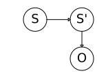

You can unroll this:

HMMs, however, may also have internal structures, more commonly in the transition model, but sometimes in the observation model as well.

### Plate models

A common template model is a _plate model_.

Say we are repeatedly flipping a coin.

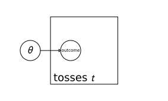

The surrounding box is the _plate_. The idea is that these are "stacked", one for each toss $t$. That is, they are indexed by $t$.

The $\theta$ node denotes the CPD parameters. This is outside the plate, i.e. it is not indexed by $t$.

Another way of visualizing this:

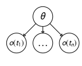

Where $o(t_i)$ is the outcome at time $t_i$. This representation makes it more obvious that each of these plates is a copy of a template.

Another example:

Plates may be _nested_:

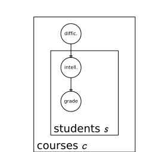

If we were to draw this out for two courses and two students:

One oddity here is that now intelligence depends on both the student $s$ and the course $c$, whereas before it depends only on the student $s$. Maybe this is desired, but let's say we want what we had before. That is, we want intelligence to be independent of the course $c$.

Instead, we can use _overlapping_ plates:

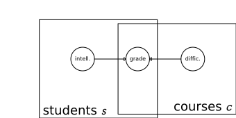

Plate models allow for _collective inference_, i.e. they allow us to look at the aggregate of these individual instances in order to find broader patterns.

More formally, a _plate dependency model_:

For a template variable $A(U_1, \dots, U_k)$ we have template parents $B_1(U_1), \dots, B_m(U_m)$; that is, an index cannot appear in the parent which does not appear in the child. This is a particular limitation of plate models.

We get the following template CPD: $P(A|B_1, \dots, B_m)$.

## Structured CPDs

We can represent CPDs in tables, e.g.

|            | $g_1$ | $g_2$ | $g_3$ |
|------------|-------|-------|-------|
| $i_0, d_0$ |       |       |       |
| $i_0, d_1$ |       |       |       |
| $i_1, d_0$ |       |       |       |
| $i_1, d_1$ |       |       |       |

But as we start to have more variables, this table can explode in size.

More generally, we can just represent a CPD $P(X|Y_1, \dots, Y_k)$, which specifies a distribution over $X$ for each assignment $Y_1, \dots, Y_k$ using any function which specifies a factor $\phi(X, Y_1, \dots, Y_k)$ such that:

$$
\sum_x \phi(x, y_1, \dots, y_k) = 1
$$

for all $y_1, \dots, y_k$.

There are many models for representing CPDs, including:

- deterministic CPDs
- tree-structured CPDs
- logistic CPDs and generalizations
- noisy OR/AND
- linear Gaussians and generalizations

_Context-specific independence_ shows up in some CPD representations. It is a type of independence where we have a particular assignment $c$, from some set of variables $C$, $P \vDash (X \perp_c Y | Z, c)$

Which is to say this independence holds only for particular values of $c$, rather than all values of $c$.

For example, consider:

Where $X$ is a deterministic `OR` of $Y_1, Y_2$.

Consider:

* $X \perp Y_1 | y_2^0$. When $Y_2$ is false, $X$ just takes on the value of $Y_1$, so there's no context-specific independence here.
* $X \perp Y_1 | y_2^1$. When $Y_2$ is true, then it doesn't matter what value $Y_1$ takes, since $X$ will be true too. Thus we have context-specific independence.
* $Y_1 \perp Y_2 | x^0$. If we know $X$ is false, we already know $Y_1, Y_2$ are false, independent of each other. So we have context-specific independence here.
* $Y_1 \perp Y_2 | x^1$. We don't have context-specific independence here.

### Tree-structured CPDs

Say we have the following model:

That is, whether or not a student gets a job $J$ depends on:

- $A$ - if they applied ($+a, -a$)
- $L$ - if they have a letter of recommendation ($+l, -l$)
- $S$ - if they scored well on the SAT ($+s, -s$)

We can represent the CPD as a tree structure.

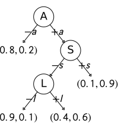

Note that the notation at the leaf nodes is the probability of not getting the job and of getting it, i.e. $(P(-j), P(+j)$.

A bit more detail: we're assuming its possible that the student gets the job without applying, e.g. via a recruiter, in which case the SAT score and letter aren't important.

We also assume that if the student scored well on the SAT, the letter is unimportant.

We have three binary random variables. If we represented this CPD as a table, it have $2^3=8$ conditional probability distributions. However, in certain contexts we only need 4 distributions since we have some context-specific independences:

* $J \perp_c L| +a, +s$
* $J \perp_c L,S| -a$
* $J \perp_c L| +s, A$

This last one is just a compact representation of:

* $J \perp_c L| +s, +a$
* $J \perp_c L| +s, -a$

Consider another model:

Where the student chooses only one letter to submit.

The tree might look like:

Here the choice variable $C$ determines the dependence of one set of circumstances on another set of circumstances.

This scenario has context-specific independence but also non-context-specific independence:

$$
L_1 \perp L_2 | J, C
$$

Because, if you break it down into its individual cases:

* $L_1 \perp_c L_2 | J, c_1$
* $L_1 \perp_c L_2 | J, c_2$

both are true.

This scenario relates to a class of CPDs called _multiplexer_ CPDs:

$Y$ has two lines around it to indicate deterministic dependence.

Here we have some variables $Z_1, \dots, Z_k$ and $A$ is a copy of _one_ of these variables.

$A$ is the _multiplexer_, i.e. the "selector variable", taking a value from $\{1, \dots, k\}$.

For a multiplexer CPD, we have:

$$
P(Y|A,Z_1, \dots, Z_k) = \begin{cases}
1 & Y=Z_a \\
0 & \text{otherwise}
\end{cases}
$$

That is, the value of $A$ just determines which $Z$ value $Y$ takes on.

### Noisy OR CPDs

In a noise OR CPD we introduce intermediary variables between $x_i$ and $Y$. These intermediary variables $z$ take on 1 if its parent value satisfies its criteria. $Y$ becomes an OR variable which is true if any of the $z$ variables are true.

That is:

$$
P(z_i=1|x_i) = \begin{cases}
0 &\text{if $x_i=0$} \\
\lambda_i &\text{if $x_i=1$}
\end{cases}
$$

Where $\lambda_i \in [0,1]$.

So if $x_i=0$, $z_i$ never gets turned on. If $x_i=1$, $z_i$ gets turned on with probability $lambda_i$.

$z_0$ is a "leak" probability which is the probability that $Y$ gets turned on by itself. $P(z_0=1) = \lambda_0$.

We can write this as a probability and consider the CPD of $Y=0$ given our $x$ variables. That is, what is the probability that all the $x$ variables fail to turn on their corresponding $z$ variables?

$$
P(Y=0|X_1, \dots, X_k) = (1-\lambda_0) \prod_{i:x_i=1} (1- \lambda_i)
$$

where $(1-\lambda_0)$ is the probability that $Y$ doesn't get turned on by the leak.

Thus:

$$
P(Y=1|X_1, \dots, X_k) = 1 - P(Y=0|X_1, \dots, X_k)
$$

A noisy OR CPD demonstrates _independence of causal influence_. We are assuming that we have a bunch of causes $x_1, \dots, x_k$ for a variable $Y$, which each act independently to affect the truth of the $Y$. That is, there is no interaction between the causes.

Other CPDs for independence of causal influence include noisy AND, noisy MAX, etc.

### Continuous variables

Consider:

We have the temperature in a room and a sensor which measures the temperature.

The sensor is not perfect, so it usually around the right temperature, but not exactly.

We can represent this by saying the sensor reading $S$ is a normal distribution around the true temperature $T$ with some standard deviation, i.e.:

$$
S \sim N(T; \sigma_S^2)
$$

This model is a _linear Gaussian_.

We can make it more complex, assuming that the outside temperature will also affect the room temperature:

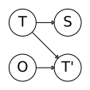

Where $T'$ is the temperature in a few moments and $O$ is the outside temperature. We may say that $T'$ is also a linear Gaussian:

$$
T' \sim N(\alpha T + (1-\alpha) O; \sigma_T^2)
$$

The $\alpha T + (1-\alpha) O$ term is just a mixture of the current temperature and the outside temperature.

We can take it another step. Say there is a door $D$ in the room which is either opened or closed (i.e. it is a binary random variable).

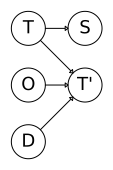

Now $T'$ is described as:

$$
\begin{aligned}
T' &\sim N(\alpha_0 T + (1-\alpha_0) O; \sigma_{0T}^2) \text{if $D=0$} \\
T' &\sim N(\alpha_1 T + (1-\alpha_1) O; \sigma_{1T}^2) \text{if $D=1$}
\end{aligned}
$$

This is a _conditional_ linear Gaussian model since its parameters are conditioned on the discrete variable $D$.

Generally, a linear Gaussian model looks like:

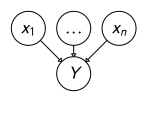

$$
Y \sim N(w_0 + \sum w_i X_i ; \sigma^2)
$$

Where $w_0 + \sum w_i X_i$ is the mean (a linear function of the parents) and $\sigma^2$ is not related to the parents/doesn't depend on the parents.

Then, conditional linear Gaussians introduce one or more discrete parents (only one, $A$, is depicted below), and this is just a linear gaussian whose parameters depend on the value of $A$:

$$
Y \sim N(w_{a0} + \sum w_{ai} X_i; \sigma_a^2)
$$

## Markov Networks

In PGMs there are broadly two classes: directed acyclic graphs (i.e. Bayesian networks) and undirected graphs - _Markov networks_, also called _Markov random fields_.

The simplest subclass is _pairwise Markov networks_.

Say we have the following scenario:

An idea is floating around and when, for example, Alice & Bob are hanging out, they may share the idea - they influence each other. We don't use a directed graph because the influence flows in both directions.

But how do you parametrize an undirected graph? We no longer have a notion of a conditional - that is, one variable conditioning another.

Well, we can just use factors:

|          | $\phi_1 [A,B]$ |
|----------|----------------|
| $-a, -b$ | 30             |
| $-a, +b$ | 5              |
| $+a, -b$ | 1              |
| $+a, +b$ | 10             |

These factors are sometimes called _affinity functions_ or _compatibility functions_ or _soft constraints_.

What do these numbers mean?

They indicate the "_local happiness_" of the variables $A$ and $B$ to take a particular joint assignment. Here $A$ and $B$ are "happiest" when $-a, -b$.

We can define factors for the other edges as well:

|          | $\phi_2 [B,C]$ |
|----------|----------------|
| $-b, -c$ | 100            |
| $-b, +c$ | 1              |
| $+b, -c$ | 1              |
| $+b, +c$ | 100            |

|          | $\phi_3 [C,D]$ |
|----------|----------------|
| $-c, -d$ | 1              |
| $-c, +d$ | 100            |
| $+c, -d$ | 100            |
| $+c, +d$ | 1              |

|          | $\phi_4 [D,A]$ |
|----------|----------------|
| $-d, -a$ | 100            |
| $-d, +a$ | 1              |
| $+d, -a$ | 1              |
| $+d, +a$ | 100            |

Then we have:

$$
\tilde P(A,B,C,D) = \phi_1(A,B) \phi_2(B,C) \phi_3(C,D) \phi_4(A,D)
$$

This isn't a probability distribution because its numbers aren't in $[0,1]$ (hence the tilde over $P$, which indicates an unnormalized measure).

We can normalize it to get a probability distribution:

$$
P(A,B,C,D) = \frac{1}{Z} \tilde P(A,B,C,D)
$$

$Z$ is known as a _partition function_.

There unfortunately is no natural mapping from the pairwise factors and the marginal probabilities from the distribution they generate.

For instance, say we are given the marginal probabilities of $P_{\Phi} (A,B)$ (the $\Phi$ indicates the probability was computed using a set of factors $\Phi = \{\phi_1, \dots, \phi_n \}$):

| $A$  | $B$  | $P_{\Phi}(A,B)$ |
|------|------|-----------------|
| $-a$ | $-b$ | 0.13            |
| $-a$ | $+b$ | 0.69            |
| $+a$ | $-b$ | 0.14            |
| $+a$ | $+b$ | 0.04            |

|          | $\phi_1 [A,B]$ |
|----------|----------------|
| $-a, -b$ | 30             |
| $-a, +b$ | 5              |
| $+a, -b$ | 1              |
| $+a, +b$ | 10             |

The most likely joint assignment is $-a, +b$, which doesn't seem to correspond to the factor. This is a result of the other factors in the network.

This is unlike Bayesian networks where the nodes were just conditional probabilities.

Formally, a _pairwise Markov network_ is an undirected graph whose nodes are $X_1, \dots, X_n$ and each edge $X_i - X_j$ is associated with a factor (aka _potential_) $\phi_{ij}(X_i-X_j)$.

Pairwise Markov networks cannot represent all of the probability distributions we may be interested in. A pairwise Markov network with $n$ random variables, each with $d$ values, has $O(n^2 d^2)$ parameters. On the other hand, if we consider a probability distribution over $n$ random variables, each with $d$ values, it has $O(d^n)$ parameters, which is far greater than $O(n^2 d^2)$.

Thus we generalize beyond pairwise Markov networks.

### Gibbs distribution

A _Gibbs distribution_ is parameterized by a set of general factors $\Phi = \{\phi_1 (D_1), \dots, \phi_k(D_k) \}$ which can have a scope of $\geq 2$ variables (whereas pairwise Markov networks were limited to two variable scopes). As a result, this can express any probability distribution because we can just define a factor over all the random variables.

We also have:

$$
\begin{aligned}
\tilde P_{\Phi} (X_1, \dots, X_n) &= \prod_{i=1}^k \phi_i (D_i) \\
Z_{\Phi} &= \sum_{X_1, \dots, X_n} \tilde P_{\Phi} (X_1, \dots, X_n)
\end{aligned}
$$

Where $Z_{\Phi}$ is the partition function, i.e. the normalizing constant.

Thus we have:

$$
P_{\Phi} (X_1, \dots, X_n) = \frac{1}{Z_{\Phi}} \tilde P_{\Phi} (X_1, \dots, X_n)
$$

We can generate an _induced Markov network_ $H_{\Phi}$ from a set of factors $\Phi$. For each factor in the set, we connect any variables which are in the same scope.

For example, $\phi_1(A,B,C), \phi_2(B,C,D)$ leads to:

So multiple set of factors can induce the same graph. We can go from a set of factors to a graph, but we can't go the other way.

We say a probability distribution $P$ factorizes over a Markov network $H$ if there exists a set of factors $\Phi$ such that $P = P_{\Phi}$ and $h$ is the induced graph for $\Phi$.

We have _active trails_ in Markov networks as well: a trail $X_1 - \dots - X_n$ is active given the set of observed variables $Z$ if no $X_i$ is in $Z$.

### Conditional Random Fields

A commonly-used variant of Markov networks is _conditional random fields_ (CRFs).

This kind of model is used to deal with _task-specific prediction_, where we have a set of input/observed variables $X$ and a set of target variables $Y$ that we are trying to predict.

Using the graphical models we have seen so far is not the best because we don't want to model $P(X,Y)$ - we are already given $X$. Instead, we just want to model $P(Y|X)$. That way we don't have to worry about how features of $X$ are correlated or independent, and we don't have to model their distributions.

In this scenario, we can use a _conditional random field_ representation:

$$
\begin{aligned}
\Phi &= \{\phi_1(D_1), \dots, \phi_k (D_k)\} \\
\tilde P_{\Phi}(X,Y) &= \prod_{i=1}^k \phi_i (D_i)
\end{aligned}
$$

This looks just like a Gibbs distribution. The difference is in the partition function:

$$
Z_{\Phi}(X) = \sum_Y \tilde P_{\Phi}(X,Y)
$$

So a CRF is parameterized the same as a Gibbs distribution, but it is normalized differently.

The end result is:

$$
P_{\Phi}(Y|X) = \frac{1}{Z_{\Phi}(X)} \tilde P_{\Phi}(X,Y)
$$

Which is a family of conditional distributions, one for each possible value of $X$.

In a Markov network, we have the concept of _separation_, which is like d-separation in Bayesian networks but we drop the "d" because they are not directed.

$X$ and $Y$ are separated in $H$ given observed evidence $Z$ if there is no active trail in $H$ (that is, no node along the trail is in $Z$).

For example:

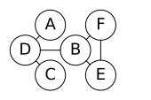

We can separate $A$ and $E$ in a few ways:

- $A$ and $E$ are separated given $B$ and $D$
- $A$ and $E$ are separated given $D$
- $A$ and $E$ are separated given $B$ and $C$

Like with Bayesian networks, we have a theorem: if $P$ factorizes over $H$ and $\text{sep}_H (X,Y|Z)$, then $P$ satisfies $(X \perp Y|Z)$.

We can say the independences induced by the graph $H$, $I(H)$, is:

$$
I(H) = \{(X \perp Y|Z) | \text{sep}_H (X,Y|Z) \}
$$

If $P$ satisfies $I(H)$, we say that $H$ is an I-map (independency map) of $P$ (this is similar to I-maps in the context of Bayesian networks).

We can also say that if $P$ factorizes over $H$, then $H$ is an I-map of $P$.

The converse is also true: for a positive distribution $P$, if $H$ is an I-map for $P$, then $P$ factorizes over $H$.

If a graph $G$ is an I-map of $P$, it does not necessarily need to encode all independences of $P$, just those that it does encode are in fact in $P$.

How well can we capture a distribution $P$'s independences in a graphical model?

We can denote all independences that hold in $P$ as:

$$
I(P) = \{(X \perp Y|Z) | P \vDash (X \perp Y|Z)\}
$$

We know that if $P$ factorizes over $G$, then $G$ is an I-map for $P$:

$$
I(G) \subseteq I(P)
$$

The converse doesn't hold; $P$ may have some independences not in $G$.

We want graphs which encode more independences because they are sparser (less parameters) and more informative.

So for sparsity, we want a _minimal I-map_; that is, an I-map without redundant edges. But it is still not sufficient for capturing $I(P)$.

Ideally, we want a _perfect map_, which is an I-map such that $I(G) = I(P)$. Unfortunately, not ever distribution has a perfect map, although sometimes a distribution may have a perfect map as a Markov network and not as a Bayesian network, and vice versa.

It is possible that a perfect map for a distribution is not unique; that is, there may be other graphs which model the same set of independence assumptions and thus are also perfect maps.

When graphs model the same independence assumptions, we say they are _I-equivalent_. Most graphs have many I-equivalent variants.

### Log-linear models

Log-linear models allow us to incorporate local structure into undirected models.

In the original representation of unnormalized density, we had:

$$
\tilde P = \prod_i \phi_i(D_i)
$$

We turn this into a linear form:

$$
\tilde P = \exp(- \sum_j w_j f_j(D_j))
$$

Hence the name "log-linear", because the log is a linear function.

Each feature $f_j$ has a scope $D_j$. Different features can have the same scope.

We can further write it in the form:

$$
\tilde P = \prod_j \exp(-w_j f_j(D_j))
$$

which effectively turns the $\exp(-w_j f_j(D_j))$ term into a factor with one parameter $w_j$.

For example, say we have binary variables $X_1$ and $X_2$:

$$
\phi(X_1,X_2) = \begin{bmatrix}
a_{00} & a_{01} \\
a_{10} & a_{11}
\end{bmatrix}
$$

We must define the following features using indicator functions (1 if true, else 0):

$$
\begin{aligned}
f_{12}^{00} &= \mathbb{1} \{X_1=0, X_2=0\} \\
f_{12}^{01} &= \mathbb{1} \{X_1=0, X_2=1\} \\
f_{12}^{10} &= \mathbb{1} \{X_1=1, X_2=0\} \\
f_{12}^{11} &= \mathbb{1} \{X_1=1, X_2=1\}
\end{aligned}
$$

So we have the log-linear model:

$$
\phi(X_1, X_2) = \exp(- \sum_{kl} w_{kl} f_{ij}^{kl} (X_1, X_2))
$$

So we can represent any factor as a log-linear model by including the appropriate features.

For example, say you want to develop a language model for labeling entities in text.

You have target labels $Y = \{\text{PERSON}, \text{LOCATION}, \dots\}$ and input words $X$.

You could, for instance, have the following features:

$$
\begin{aligned}
f(Y_i, X_i) &= \mathbb{1} \{Y_i=\text{PERSON}, X_i \text{ is capitalized}\} \\
f(Y_i, X_i) &= \mathbb{1} \{Y_i=\text{LOCATION}, X_i \text{ appears in an atlas}\}
\end{aligned}
$$

and so on.

### Metrics

An often used feature is a _metric_ feature.

Say you have a bunch of random variables $X_i$ which take on values in a label space $V$. If $X_i$ and $X_j$ are connected by an edge, we want them to take on "similar" values.

How do we define "similar"?

We'll use a distance function $\mu: V \times V \to R^+$, which needs to satisfy:

- _reflexivity_: $\mu(v,v)=0$ for all $v$
- _symmetry_: $\mu(v_1,v_2)=\mu(v_2, v_1)$ for all $v_1, v_2$
- _triangle inequality_: $\mu(v_1, v_2) \leq \mu(v_1, v_3) + \mu(v_3, v_2)$ for all $v_1, v_2, v_3$

If all these are satisfied, we say that $\mu$ is a _metric_.

If only reflexivity and symmetry are satisfied, we have a _semi-metric_ instead.

So we can create a feature $f_{ij}(X_i, X_j) = \mu(X_i, X_j)$ and then this works out such that:

$$
\exp(- w_{ij} f_{ij} (X_i, X_j)), w_{ij} > 0
$$

that the lower the distance (metric), the higher the probability.

## Conditional probability queries

PGMs can be used to answer many queries, but the most common is probably _conditional probability queries_:

Given evidence $e$ about some variables $E$, we have a query which is a subset of variables $Y$, and our task is to compute $P(Y|E=e)$.

Unfortunately, the problem of inference on graphical models is NP-Hard. In particular, the following are NP-Hard:

- _exact inference_
  - given a PGM $P_{\Phi}$, a variable $X$ and a value $x \in \text{Val}(X)$, compute $P_{\Phi}(X=x)$
  - even just deciding if $P_{\Phi}(X=x) > 0$ is NP-hard
- _approximate inference_
  - let $\epsilon < 0.5$. Given a PGM $P_{\Phi}$, a variable $X$, a value $x \in \text{Val}(X)$, and an observation $e \in \text{Val}(E)$, find a number $p$ that has $|P_{\Phi}(X=x|E=e) - p| < \epsilon$.

However, NP-Hard is the worst case result and their are algorithms that perform for most common cases.

Some conditional probability inference algorithms:

- variable elimination
- message passing over a graph
  - belief propagation
  - variational approximations
- random sampling instantiations
  - Markov Chain Monte Carlo (MCMC)
  - importance sampling

## MAP (maximum a posteriori) inference

PGMs can also answer MAP queries:

We have a set of evidence $E=e$, the query is all other variables $Y$, i.e. $Y = \{X_1, \dots, X_n\} - E$. Our task is to compute $\text{MAP}(Y|E=e) = \argmax_y P(Y=y|E=e)$. There may be more than one possible solution.

This is also a NP-hard problem, but there are also many algorithms to solve these efficiently for most cases.

Some MAP inference algorithms:

- variable elimination
- message passing over a graph
  - max-product belief propagation
- using methods for integer programming
- for some networks, graph-cut methods
- combinatorial search

## References

- Bayesian Reasoning and Machine Learning. David Barber.
- Probabilistic Graphical Models. Daphne Koller. Stanford University (Coursera).

