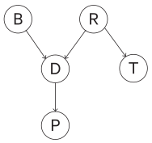
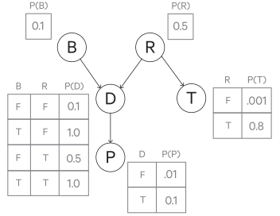

# Probabilistic Graphical Models

The key tool for probabilistic inference is the _joint probability table_. Each row in a joint probability table describes a combination of values for a set of random variables. That is, say you have $n$ events which have a binary outcome (T/F). A row would describe a unique configuration of these events, e.g. if $n=4$ then one row might be $0,0,0,0$ and another might be $1,0,0,0$ and so on.

Using a joint probability table you can learn a lot about how those events are related probabilistically.

The problem is, however, that joint probability tables can get very big. There will be $2^n$ rows (for this binary case; with more outcomes naturally leading to even bigger tables), so if you are looking at 10 events you already have 1,024 rows to consider.

We can use __probabilistic graphical models__ to reduce this space. Probabilistic graphical models allow us to represent complex networks of interrelated and independent events.

There are two main types of graphical models:

- __Bayesian models__: aka __Bayesian networks__, sometimes called _Bayes nets_ or __belief networks__. These are used when there are causal relationships between the random variables.
- __Markov models__: used when there are noncausal relationships between the random variables.

## Bayesian Networks

Say we are looking at five events:

- a dog barking ($D$)
- a raccoon being present ($R$)
- a burglar being present ($B$)
- a trash can is heard knocked over ($T$)
- the police are called ($P$)

We can encode some assumptions about how these events are related in a _belief net_ (also called a _Bayesian net_):

Every node is dependent on its parent and nothing else that is not a descendant. To put it another way: given its parent, a node is independent of all its non-descendants.

For instance, the event $P$ is dependent on its parent $D$ but not $B$ or $R$ or $T$ because their causality flows through $D$.

$D$ depends on $B$ and $R$ because they are its parents, but not $T$ because it is not a descendant or a parent. But $D$ may depend on $P$ because it is a descendant.

We can then annotate the graph with probabilities:

The $B$ and $R$ nodes have no parents so they have singular probabilities.

The others depend on the outcome of their parents.

With the belief net, we only needed to specify 10 probabilities.

If we had just constructed joint probability table, we would have had to specify $2^5=32$ probabilities (rows).

If we expand out the conditional probability of this system using the chain rule, it would look like:

$$
P(p,d,b,t,r) = P(p|d,b,t,r)P(d|b,t,r)P(b|t,r)P(t|r)P(r)
$$

But we can bring in our belief net's conditional independence assumptions to simplify this:

$$
P(p,d,b,t,r) = P(p|d)P(d|b,r)P(b)P(t|r)P(r)
$$

Belief networks are _acyclical_, that is, they cannot have any loops (a node cannot have a path back to itself).

Two nodes (variables) in a Bayes net are on an __active trail__ if a change in one node affects the other. This includes cases where the two nodes have a causal relationship, an evidential relationship, or have some common cause.

## Hidden Markov Models (HMM)

__Hidden Markov Models__ are Bayes nets in which each state $S_i$ depends only on the previous state $S_{i-1}$ (so the sequence of states is a Markov chain) and emits an observation $z_i$. It is hidden because we do not observe the states directly, but only these observations. The actual observations are stochastic (e.g. an underlying state may produce one of many observations with some probability). We try to infer the state based on these observations.

The parameters of a HMM are:

- The initial state distribution, $P(S_0)$
- The transition distribution, $P(S_2|S_1)$
- The measurement/observation distribution, $P(z_1|S_1)$

### Example

Say we have the following HMM:

We don't know the starting state, but we know the probabilities:

$$
\begin{aligned}
P(R_0) &= \frac{1}{2} \\
P(S_0) &= \frac{1}{2}
\end{aligned}
$$

Say on the first day we see that this person is happy and we want to know whether or not it is raining. That is:

$$
P(R_1|H_1)
$$

We can use Bayes' rule to compute this posterior:

$$
P(R_1|H_1) = \frac{P(H_1|R_1)P(R_1)}{P(H_1)}
$$

We can compute these values by hand:

$$
\begin{aligned}
P(R_1) &= P(R_1|R_0)P(R_0) + P(R_1|S_0)P(S_0) \\
P(H_1) & = P(H_1|R_1)P(R_1) + P(H_1|S_1)P(S_1)
\end{aligned}
$$

$P(H_1|R_1)$ can be pulled directly from the graph.

Then you can just run the numbers.

## References

- MIT 6.034 (Fall 2010): Artificial Intelligence. Patrick H. Winston.
