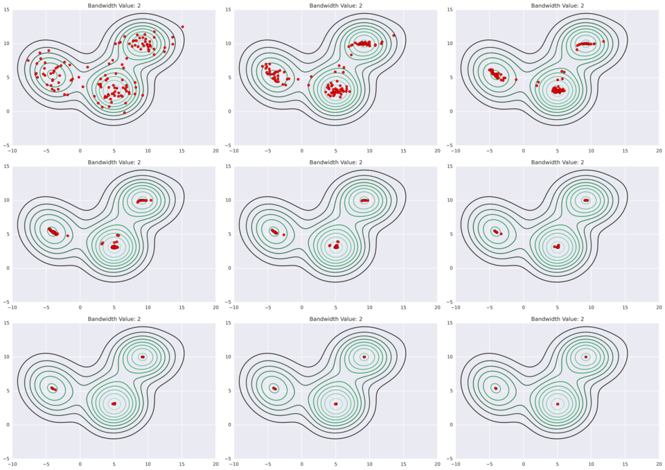
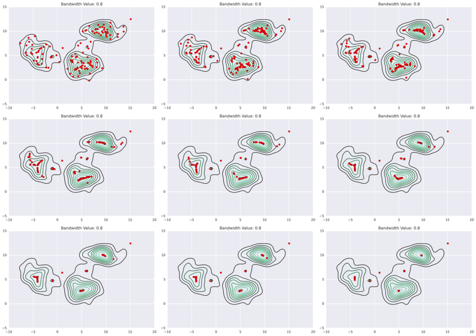
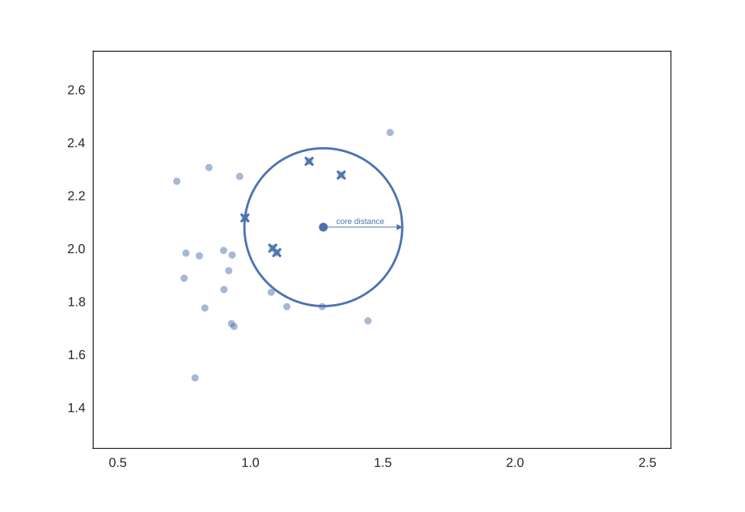
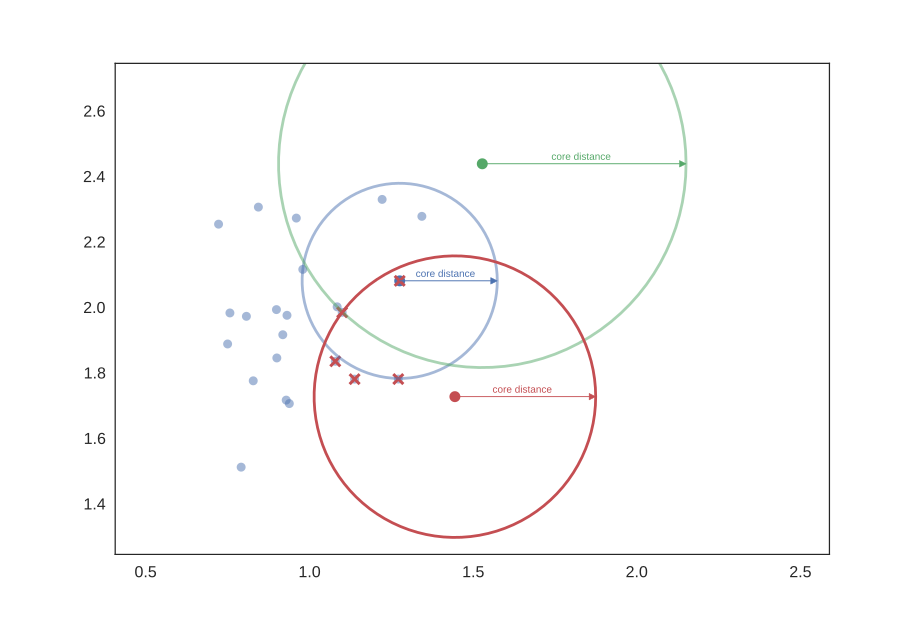
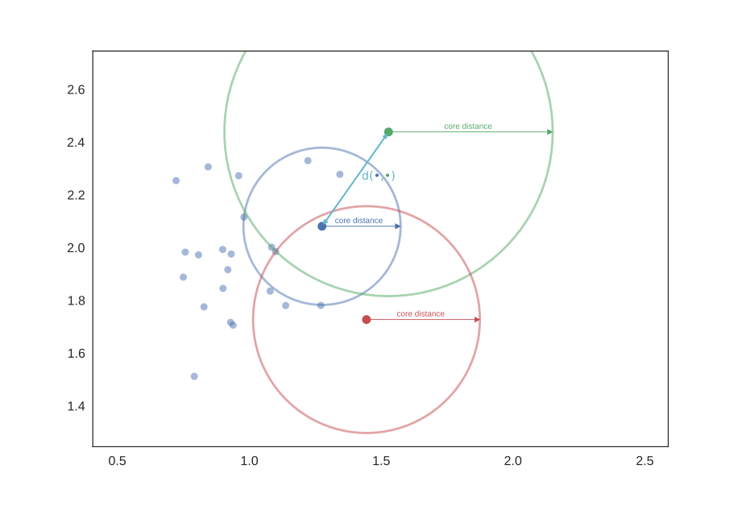
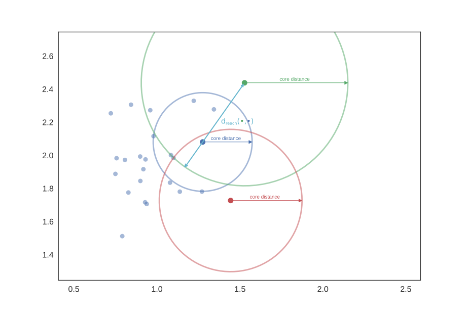

# Unsupervised Learning

In unsupervised learning, our data does not have any labels. Unsupervised learning algorithms try to find some structure in the data.

An example is a _clustering_ algorithm. We don't tell the algorithm in advance anything about the structure of the data; it discovers it on its own by figuring how to group them.

Some other examples are _dimensionality reduction_, in which you try to reduce the dimensionality of the data representation, _density estimation_, in which you estimate the probability distribution of the data, $p(x)$, and _feature extraction_, in which you try to learn meaningful features automatically.

## k-Nearest Neighbors (kNN)

A very simple nonparametric classification algorithm in which you take the $k$ closest neighbors to a point ("closest" depends on the distance metric you choose) and each neighbor constitutes a "vote" for its label. Then you assign the point the label with the most votes.

Because this is essentially predicting an input's label based on similar instances, kNN is a _case-based approach_. The key with case-based approaches is how you define similarity - a common way is feature dot products:

$$
\text{sim}(x, x') = x \cdot x' = \sum_i x_i x_i'
$$

$k$ can be chosen heuristically: generally you don't want it to be so high that the votes become noisy (in the extreme, if you have $n$ datapoints and set $k=n$, you will just choose the most common label in the dataset), and you want to chose it so that it is coprime with the number of classes (that is, they share no common divisors except for 1). This prevents ties.

Alternatively, you can apply an optimization algorithm to choose $k$.

Some distances that you can use include Euclidean distance, Manhattan distance (also known as the city block distance or the taxicab distance), Minkowski distance (a generalization of the Manhattan and Euclidean distances), and Mahalanobis distance.

Minkowski-type distances assume that data is symmetric; that in all dimensions, distance is on the same scale. Mahalanobis distance, on the other hand, takes into account the standard deviation of each dimension.

kNN can work quite quickly when implemented with something like a k-d tree.

kNN and other case-based approaches are examples of nonparametric models. With nonparametric models, there is not a fixed set of parameters (which isn't to say that there are _no_ parameters, though the name "nonparametric" would have you think otherwise). Rather, the complexity of the classifier increases with the data. Nonparametric models typically require a lot of data before they start to be competitive with parametric models.

## Clustering

### K-Means Clustering Algorithm

First, randomly initialize $K$ points, called the _cluster centroids_.

Then iterate:

- Cluster assignment step: go through each data point and assign it to the closest of the $K$ centroids.
- Move centroid step: move the centroids to the average of their points.

Closeness is computed by some distance metric, e.g. euclidean.

More formally, there are two inputs:

- $K$ - the number of clusters
- The training set $\\{x^{(1)}, x^{(2)}, \dots, x^{(m)}\\}$

Where $x^{(i)} \in \mathbb R^n$ (we drop the $x_0 = 1$ convention).

Randomly initialize $K$ cluster centroids $\mu_1, \mu_2, \dots, \mu_K \in \mathbb R^n$.

Repeat:

- For $i=1$ to $m$
    - $c^{(i)} :=$ index (from 1 to $K$) of cluster centroid closest to $x^{(i)}$. That is, $c^{(i)} := \text{min}_k ||x^{(i)} - \mu_k||$.
- For $k=1$ to $K$
    - $\mu_k :=$ average (mean) of points assigned to cluster $k$

If you have an empty cluster, it is common to just eliminate it entirely.

We can notate the cluster centroid of the cluster to which example $x^{(i)}$ has been assigned as $\mu_{c^{(i)}}$.

In K-means, the optimization objective is:

$$
\begin{aligned}
J(c^{(i)}, \dots, c^{(m)}, \mu_1, \dots, \mu_K) = \frac{1}{m} \sum^m_{i=1} ||x^{(i)} - \mu_{c^{(i)}}||^2 \\
min_{c^{(i)}, \dots, c^{(m)}, \mu_1, \dots, \mu_K} J(c^{(i)}, \dots, c^{(m)}, \mu_1, \dots, \mu_K)
\end{aligned}
$$

This cost function is sometimes called the _distortion_ cost function or the distortion of the K-means algorithm.

The algorithm outlined above is minimizing the cost: the first step tries to minimize $c^{(i)}, \dots, c^{(m)}$ and the second step tries to minimize $\mu_1, \dots, \mu_K$.

Note that we randomly initialize the centroids, so different runs of K-means could lead to (very) different clusterings.

One question is - what's the best way to initialize the initial centroids to avoid local minima of the cost function?

First of all, you should halve $K < m$ (i.e. less than your training examples.)

Then randomly pick $K$ training examples. Use these as your initialization points (i.e. set $\mu_1, \dots, \mu_k$ to these $K$ examples).

Then, to better avoid local optima, just rerun K-means several times (e.g. 50-1000 times) with new initializations of points. Keep track of the resulting cost function and then pick the clustering that gave the lowest cost.

So, how do you choose a good value for $K$?

Unfortunately, there is no good way of doing this automatically. The most common way is to just choose it manually by looking at the output. If you plot out the data and look at it - even among people it is difficult to come to a consensus on how many clusters there are.

One method that some use is the _Elbow method_. In this approach, you vary $K$, run K-means, and compute the cost function for each value. If you plot out $K$ vs the cost functions, there may be a clear "elbow" in the graph and you pick the $K$ at the elbow. However, most of the time there isn't a clear elbow, so the method is not very effective.

One drawback of K-means (which many other clustering algorithms share) is that _every_ point has a cluster assignment, which is to say K-means has no concept of "noise".

Furthermore, K-means expects clusters to be globular, so it can't handle more exotic cluster shapes (such as moon-shaped clusters).

There are still many situations where K-means is quite useful, especially since it scales well to large datasets.

### Hierarchical Agglomerative Clustering

Hierarchical agglomerative clustering (HAC) is a bottom-up clustering process which is fairly simple:

1. Find two closest data points or clusters, merge into a cluster (and remove the original points or clusters which formed the new cluster)
2. Repeat

This results in a hierarchy (e.g. a tree structure) describing how the data can be grouped into clusters and clusters of clusters. This structure can be visualized as a dendrogram:

Two things which must be specified for HAC are:

- the distance metric: euclidean, cosine, etc
- the merging approach - that is, how is the distance between two clusters measured?
    - _complete linkage_ - use the distance between the two further points
    - _average linkage_ - take the average distances of all pairs between the clusters
    - _single linkage_ -  take the distance between the two nearest points
    - (there are others as well)

Unlike K-means, HAC is deterministic (since there are no randomly-initialized centroids) but it can be unstable: changing a few points or the presence of some outliers can vastly change the result. Scaling of variables/features can also affect clustering.

HAC does not assume globular clusters, although it does not have a concept of noise.

### Affinity Propagation

In affinity propagation, data points "vote" on their preferred "exemplar", which yields a set of exemplars as the initial cluster points. Then we just assign each point to the nearest exemplar.

Affinity Propagation is one of the few clustering algorithms which supports non-metric dissimilarities (i.e. the dissimilarities do not need to be symmetric or obey the triangle inequality).

Like K-means, affinity propagation also does not have a concept of noise and also assumes that clusters are globular. Unlike K-means, however, it is deterministic, and it does not scale very well (mostly because its support for non-metric dissimilarities precludes it from many optimizations that other algorithms can take advantage of).

### Spectral Clustering

With spectral clustering, datapoints are clustered by _affinity_ - that is, by nearby points - rather than by centroids (as is with K-Means). Using affinity instead of centroids, spectral clustering can identify clusters where K-Means fails to.

In spectral clustering, an _affinity matrix_ is produced which, for a set of $n$ datapoints, is an $n \times n$ matrix. Pairwise affinities are computed for the dataset. Affinity is some distance metric.

Then, from this affinity matrix, PCA is used to extract the eigenvectors with the largest eigenvalues and the data is then projected to the new space defined by PCA. The data will be more clearly separated in this new representation such that conventional clustering methods (e.g. K-Means) can be applied.

More formally: spectral clustering generates a graph of the datapoints, with edges as the distances between the points. Then the Laplacian of the graph is produced:

Given the adjacency matrix $A$ and the degree matrix $D$ of a graph $G$ of $n$ vertices, the Laplacian matrix $L_{n \times n}$ is simply $L = D - A$.

As a reminder:

- the adjacency matrix $A$ is an $n \times n$ matrix where the element $A_{i,j}$ is 1 if an edge exists between vertices $i$ and $j$ and 0 otherwise.
- the degree matrix $D$ is an $n \times n$ diagonal matrix where the element $D_{i,i}$ is the degree of vertex $i$.

Then the eigenvectors of the Laplacian are computed to find an embedding of the graph into Euclidean space. Then some clustering algorithm (typically K-Means) is run on the data in this transformed space.

Spectral clustering enhances clustering algorithms which assume globular clusters in that its space transformation of the data causes non-globular data to be globular in the transformed space. However, the graph transformation slows things down.

### Mean Shift Clustering

_Mean shift clustering_ extends KDE one step further: the data points iteratively hill-climb to the peak of nearest KDE surface.

As a parameter to the kernel density estimates, you need to specify a _bandwidth_ - this will affect the KDEs and their peaks, and thus it will affect the clustering results. You do not, however, need to specify the number of clusters.

Below are some examples of different bandwidth results ([source](http://spin.atomicobject.com/2015/05/26/mean-shift-clustering/)).

You also need to make the choice of what kernel to use. Two commonly used kernels are:

- Flat kernel:

$$
K(x) =
\begin{cases}
1 & \text{if $||x|| \leq 1$} \\
0 & \text{otherwise}
\end{cases}
$$

- Gaussian kernel

Mean shift is slow ($O(N^2)$).

### Non-Negative Matrix Factorization (NMF)

NMF is a particular matrix factorization in which each element of $V$ is $\geq 0$ (a non-negative constraint), and results in factor matrices $W$ and $H$ such that each of their elements are also $\geq 0$.

Each column $v_i$ in $V$ can be calculated from $W$ and $H$ like so (where $h_i$ is a column in $H$):

$$
v_i = W h_i
$$

NMF can be used for clustering; it has a consequence of naturally clustering the columns of $V$.

It is also useful for reducing (i.e. compressing) the dimensionality of a dataset, in particular, it reduces it into a linear combination of bases.

If you add an orthogonality constraint, i.e. $HH^T = I$, if the value at $H_{kj} > 0$, then the $j$th column of $V$, that is, $v_j$, belongs to the cluster $k$.

#### Matrix factorization

Let $V$ be an $m \times n$ matrix of rank $r$. Then there is an $m \times r$ matrix $W$ and an $r \times n$ matrix $H$ such that $V=WH$. So we can factorize (or _decompose_) $V$ into $W$ and $H$.

This matrix factorization can be seen as a form of compression (for low rank matrices, at least) - if we were to store $V$ on its own, we have to store $m \times n$ elements, but if we store $W$ and $H$ separately, we only need to store $m \times r + r \times n$ elements, which will be smaller than $m \times n$ for low rank matrices.

Note that this kind of factorization can't be solved analytically, so it is usually approximated numerically (there are a variety of algorithms for doing so).

### DBSCAN

DBSCAN transforms the space according to density, then identifies for dense regions as clusters by using single linkage clustering. Sparse points are considered noise - not all points are forced to have cluster assignment.

DBSCAN handles non-globular clusters well, provided they have consistent density - it has some trouble with variable density clusters (they may be split up into multiple clusters).

### HDBSCAN

HDBSCAN is an improvement upon DBSCAN which can handle variable density clusters, while preserving the scalability of DBSCAN. DBSCAN's epsilon parameter is replaced with a "min cluster size" parameter.

HDBSCAN uses single-linkage clustering, and a concern with single-linkage clustering is that some errant point between two clusters may accidentally act as a bridge between them, such that they are identified as a single cluster. HDBSCAN avoids this by first transforming the space in such a way that sparse points (these potentially troublesome noise points) are pushed further away.

To do this, we first define a distance called the __core distance__, $\text{core}_k(x)$, which is point $x$'s distance from its $k$th nearest neighbor.

Then we define a new distance metric based on these core distances, called __mutual reachability distance__. The mutual reachability distance $d_{\text{mreach}-k}$ between points $a$ and $b$ is the furthest of the following points: $\text{core}_k(a), \text{core}_k(b), d(a,b)$, where $d(a,b)$ is the regular distance metric between $a$ and $b$. More formally:

$$
d_{\text{mreach}-k}(a, b) = \max(\text{core}_k(a), \text{core}_k(b), d(a,b))
$$

For example, if $k=5$:

Then we can pick another point:

And another point:

Say we want to compute the mutual reachability distance between the blue $b$ and green $g$ points.

First we can compute $d(b, g)$:

Which is larger than $\text{core}_k(b)$, but both are smaller than $\text{core}_k(g)$. So the mutual reachability distance between $b$ and $g$ is $\text{core}k(g)$:

On the other hand, the mutual reachability distance between the red and green points is equal to $d(r, g)$ because that is larger than either of their core distances.

We build a distance matrix out of these mutual reachability distances; this is the transformed space. We can use this distance matrix to represent a graph of the points.

We want to construct a minimum spanning tree out of this graph.

As a reminder, a _spanning tree_ of a graph is any subgraph which contains all vertices and is a tree (a tree is a graph where vertices are connected by only one path; i.e. it is a connected graph - all vertices are connected - but there are no cycles).

The weight of a tree is the sum of its edges' weights. A minimum spanning tree is a spanning tree with the least (or equal to least) weight.

The minimum spanning tree of this graph can be constructed using Prim's algorithm.

From this spanning tree, we then want to create the cluster hierarchy. This can be accomplished by sorting edges from closest to furthest and iterating over them, creating a merged cluster for each edge.

(A note from the original post which I don't understand yet: "The only difficult part here is to identify the two clusters each edge will join together, but this is easy enough via a union-find data structure.")

Given this hierarchy, we want a set of flat clusters. DBSCAN asks you to specify the number of clusters, but HDBSCAN can independently discover them. It does require, however, that you specify a minimum cluster size.

In the produced hierarchy, it is often the case that a cluster splits into one large subcluster and a few independent points. Other times, the cluster splits into two good-sized clusters. The minimum cluster size makes explicit what a "good-sized" cluster is.

If a cluster splits into clusters which are at or above the minimum cluster size, we consider them to be separate clusters. Otherwise, we don't split the cluster (we treat the other points as having "fallen out of" the parent cluster) and just keep the parent cluster intact. However, we keep track of which points have "fallen out" and at what distance that happened. This way we know at which distance cutoffs the cluster "sheds" points. We also keep track at what distances a cluster split into its children clusters.

Using this approach, we "clean up" the hierarchy.

We use the distances at which a cluster breaks up into subclusters to measure the _persistence_ of a cluster. Formally, we think in terms of $\lambda = \frac{1}{\text{distance}}$.

We define for each cluster a $\lambda_{\text{birth}}$, which is the distance at which this cluster's parent split to yield this cluster, and a $\lambda_{\text{death}}$, which is the distance at which this cluster itself split into subclusters (if it does eventually split into subclusters).

Then, for each point $p$ within a cluster, we define $\lambda_p$ to be when that point "fell out" of the cluster, which is either somewhere in between $\lambda_{\text{birth}}, \lambda_{\text{death}}$, or, if the point does not fall out of the cluster, it is just $\lambda_{\text{death}}$ (that is, it falls out when the cluster itself splits).

The _stability_ of a cluster is simply:

$$
\sum_{p \in \text{cluster}} (\lambda_p - \lambda_{\text{birth}})
$$

Then we start with all the leaf nodes and select them as clusters. We move up the tree and sum the stabilities of each cluster's child clusters. Then:

- If the sum of cluster's child stabilities _greater_ than its own stability, then we set its stability to be the sum of its child stabilities.
- If the sum of a cluster's child stabilities is _less_ than its own stability, then we select the cluster and unselect its descendants.

When we reach the root node, return the selected clusters. Points not in any of the selected clusters are considered noise.

As a bonus: each $\lambda_p$ in the selected clusters can be treated as membership strength to the cluster if we normalize them.

### CURE (Clustering Using Representatives)

If you are dealing with more data than can fit into memory, you may have issues clustering it.

A flexible clustering algorithm (there are no restrictions about the shape of the clusters it can find) which can handle massive datasets is CURE.

CURE uses Euclidean distance and generates a set of $k$ representative points for each clusters. It uses these points to represent clusters, therefore avoiding the need to store every datapoint in memory.

CURE works in two passes.

For the first pass, a random sample of points from the dataset are chosen. The more samples the better, so ideally you choose as many samples as can fit into memory. Then you apply a conventional clustering algorithm, such as hierarchical clustering, to this sample. This creates an initial set of clusters to work with.

For each of these generated clusters, we pick $k$ representative points, such that these points are as dispersed as possible within the cluster.

For example, say $k=4$. For each cluster, pick a point at random, then pick the furthest point from that point (within the same cluster), then pick the furthest point (within the same cluster) from those two points, and repeat one more time to get the fourth representative point.

Then copy each representative point and move that copy some fixed fraction (e.g. 0.2) closer to the cluster's centroid. These copied points are called "synthetic points" (we use them so we don't actually move the datapoints themselves). These synthetic points are the representatives we end up using for each cluster.

For the second pass, we then iterate over each point $p$ in the entire dataset. We assign $p$ to its closest cluster, which is the cluster that has the closest representative point to $p$.

## References

- How HDBSCAN Works. Leland McInnes. <http://nbviewer.jupyter.org/github/lmcinnes/hdbscan/blob/master/notebooks/How%20HDBSCAN%20Works.ipynb>
- Thoughtful Machine Learning. Matthew Kirk. 2015.
- Comparing Python Clustering Algorithms. Leland McInnes. <http://nbviewer.ipython.org/github/lmcinnes/hdbscan/blob/master/notebooks/Comparing%20Clustering%20Algorithms.ipynb>
- CS188: Artificial Intelligence. Dan Klein, Pieter Abbeel. University of California, Berkeley (edX).
- [Mean Shift Clustering (Matt Nedrich)](http://spin.atomicobject.com/2015/05/26/mean-shift-clustering/)
- _Mining Massive Datasets_ (Coursera & Stanford, 2014). Jure Leskovec, Anand Rajaraman, Jeff Ullman.
- <https://www.youtube.com/watch?v=o8PiWO8C3zs>
- <https://en.wikipedia.org/wiki/Non-negative_matrix_factorization#Clustering_property>
