from: <http://geoffboeing.com/2015/03/chaos-theory-logistic-map/>
code: <http://nbviewer.jupyter.org/github/gboeing/chaos-models/blob/master/chaos-logistic-model.ipynb>

# Chaos Theory and the Logistic Map

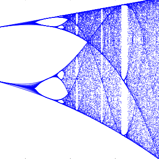_Using Python to visualize chaos, fractals, and self-similarity to better understand the limits of knowledge and prediction._

Chaos theory is a branch of mathematics that deals with nonlinear dynamical systems. A _system_ is just a set of interacting components that form a larger whole. _Nonlinear_ means that due to feedback or multiplicative effects between the components, the whole becomes something greater than just adding up the individual parts. Lastly, _dynamical_ means the system changes over time based on its current state. In the following piece, I break down some of this jargon, visualize interesting characteristics of chaos, and discuss its implications for knowledge and prediction.

Chaotic systems are a simple sub-type of nonlinear dynamical systems. They may contain very few interacting parts and these may follow very simple rules, but these systems all have a very sensitive dependence on their initial conditions. Despite their deterministic simplicity, over time these systems can produce totally unpredictable and wildly divergent (aka, chaotic) behavior. [Edward Lorenz](http://www.nytimes.com/2008/04/17/us/17lorenz.html), the father of chaos theory, [described](http://mpe2013.org/2013/03/17/chaos-in-an-atmosphere-hanging-on-a-wall/) chaos as "when the present determines the future, but the approximate present does not approximately determine the future."

## The Logistic Map

How does that happen? Let's explore an example using the famous logistic map. This model is based on the common s-curve [logistic function](https://en.wikipedia.org/wiki/Logistic_function) that shows how a population grows slowly, then rapidly, before tapering off as it reaches its carrying capacity. The logistic function uses a [differential equation](https://en.wikipedia.org/wiki/Logistic_function#Logistic_differential_equation) that treats time as continuous. The logistic map instead uses a nonlinear [difference equation](https://en.wikipedia.org/wiki/Recurrence_relation#Logistic_map) to look at discrete time steps. It's called the logistic _map_ because it maps the population value at any time step to its value at the next time step:

This equation defines the rules, or dynamics, of our system: _x_ represents the population at any given time _t_, and _r_ represents the growth rate. In other words, the population level at any given time is a function of the growth rate parameter and the previous time step's population level. If the growth rate is set too low, the population will die out and go extinct. Higher growth rates might settle toward a stable value or fluctuate across a series of population booms and busts.

As simple as this equation is, it produces chaos at certain growth rate parameters. I'll explore this below. All of my source code is in Python and available in this [IPython notebook](http://nbviewer.ipython.org/github/gboeing/chaos-models/blob/master/chaos-logistic-model.ipynb). First, I'll run the logistic model for 20 time steps (I'll henceforth call these recursive iterations of the equation _generations_) for growth rate parameters of 0.5, 1.0, 1.5, 2.0, 2.5, 3.0, and 3.5. Here are the values we get:

[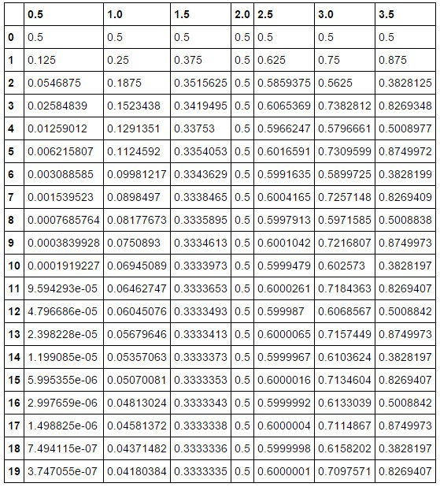](assets/chaos_theory/ba5d04ba23971828c1b5d7cc6b6fe673.jpg)

The columns represent growth rates and the rows represent generations. The model always starts with a population level of 0.5 and it's set up to represent population as a ratio between 0 (extinction) and 1 (the maximum carrying capacity of our system).

## System Behavior and Attractors

If you trace down the column under growth rate 1.5, you'll see the population level settles toward a final value of 0.333… after 20 generations. In the column for growth rate 2.0, you'll see an unchanging population level across each generation. This makes sense in the real world - if two parents produce two children, the overall population won't grow or shrink. So the growth rate of 2.0 represents the replacement rate.

Let's visualize this table of results as a line chart:

[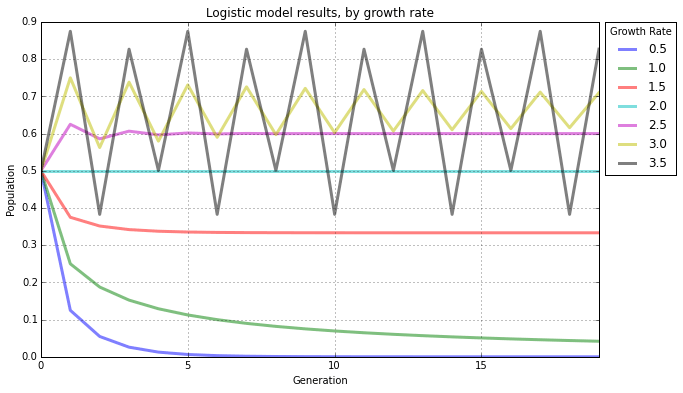](assets/chaos_theory/d7fcdf848d623ea8def1c48abb1b8494.png)

Here you can easily see how the population changes over time, given different growth rates. The blue line represents a growth rate of 0.5, and it quickly drops to zero. The population dies out. The cyan line represents a growth rate of 2.0 (remember, the replacement rate) and it stays steady at a population level of 0.5. The growth rates of 3.0 and 3.5 are more interesting. While the yellow line for 3.0 seems to be slowly converging toward a stable value, the gray line for 3.5 just seems to bounce around.

An _attractor_ is the value, or set of values, that the system settles toward over time. When the growth rate parameter is set to 0.5, the system has a fixed-point attractor at population level 0 as depicted by the blue line. In other words, the population value is drawn toward 0 over time as the model iterates. When the growth rate parameter is set to 3.5, the system oscillates between four values, as depicted by the gray line. This attractor is called a limit cycle.

But when we adjust the growth rate parameter beyond 3.5, we see the onset of chaos. A chaotic system has a _strange attractor_, around which the system oscillates forever, never repeating itself or settling into a steady state of behavior. It never hits the same point twice and its structure has a fractal form, meaning the same patterns exist at every scale no matter how much you zoom into it.

## Bifurcations and the Path to Chaos

To show this more clearly, let's run the logistic model again, this time for 200 generations across 1,000 growth rates between 0.0 to 4.0. When we produced the line chart above, we had only 7 growth rates. This time we'll have 1,000 so we'll need to visualize it in a different way, using something called a bifurcation diagram:

[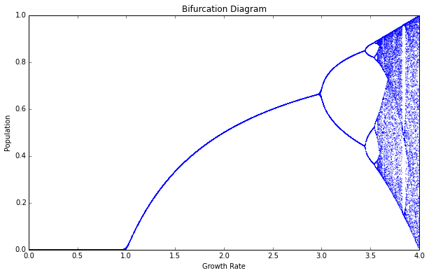](assets/chaos_theory/71d4d0b33dad19684bfa82a74766ed20.png)

Think of this bifurcation diagram as 1,000 discrete vertical slices, each one corresponding to one of the 1,000 growth rate parameters (between 0 and 4). For each of these slices, I ran the model 200 times then threw away the first 100 values, so we're left with the final 100 generations for each growth rate. Thus, each vertical slice depicts the population values that the logistic map settles toward for that parameter value. In other words, the vertical slice above each growth rate is that growth rate's attractor.

For growth rates less than 1.0, the system always collapses to zero (extinction). For growth rates between 1.0 and 3.0, the system always settles into an exact, stable population level. Look at the vertical slice above growth rate 2.5. There's only one population value represented (0.6) and it corresponds to where the magenta line settles in the line chart shown earlier. But for some growth rates, such as 3.9, the diagram shows 100 different values - in other words, a different value for each of its 100 generations. It never settles into a fixed point or a limit cycle.

So, why is this called a bifurcation diagram? Let's zoom into the growth rates between 2.8 and 4.0 to see what's happening:

[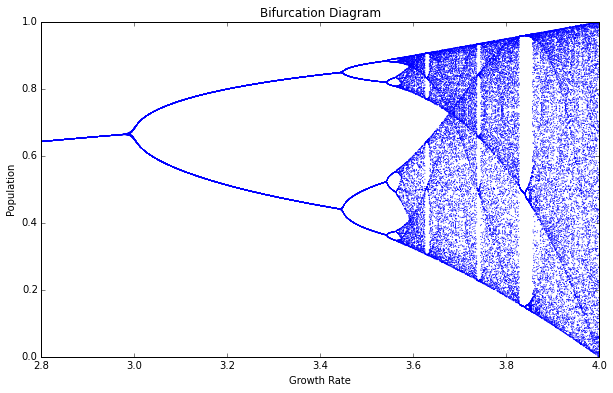](assets/chaos_theory/9ab7ee14bac80ae99248c42981911e1b.png)

At the vertical slice above growth rate 3.0, the possible population values fork into two discrete paths. At growth rate 3.2, the system essentially oscillates exclusively between two population values: one around 0.5 and the other around 0.8. In other words, at that growth rate, applying the logistic equation to one of these values yields the other.

Just after growth rate 3.4, the diagram bifurcates again into _four_ paths. This corresponds to the gray line in the line chart we saw earlier: when the growth rate parameter is set to 3.5, the system oscillates over _four_ population values. Just after growth rate 3.5, it bifurcates again into _eight_ paths. Here, the system oscillates over _eight_ population values.

## The Onset of Chaos

Beyond a growth rate of 3.6, however, the bifurcations ramp up until the system is capable of eventually landing on _any_ population value. This is known as the period-doubling path to chaos. As you adjust the growth rate parameter upwards,  the logistic map will oscillate between two then four then eight then 16 then 32 (and on and on) population values. These are _periods_, just like the period of a [pendulum](https://en.wikipedia.org/wiki/Pendulum#Period_of_oscillation).

By the time we reach growth rate 3.9, it has bifurcated so many times that the system now jumps, seemingly randomly, between all population values. I only say _seemingly_ randomly because it is definitely _not_ random. Rather, this model follows very simple deterministic rules yet produces apparent randomness. This is chaos: deterministic and aperiodic.

Let's zoom in again, to the narrow slice of growth rates between 3.7 and 3.9:

[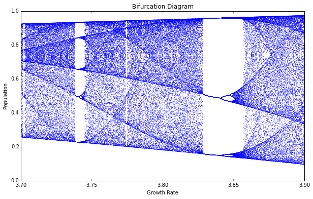](assets/chaos_theory/8dde0389adddb82b93fc9ccb691d93f9.png)

As we zoom in, we begin to see the beauty of chaos. Out of the noise emerge strange swirling patterns and thresholds on either side of which the system behaves very differently. Between the growth rate parameters of 3.82 and 3.84, the system moves from chaos back into order, oscillating between just three population values (approximately 0.15, 0.55, and 0.95). But then it bifurcates again and returns to chaos at growth rates beyond 3.86.

## Fractals and Strange Attractors

In the plot above, the bifurcations around growth rate 3.85 look a bit familiar. Let's zoom in to the center one:

[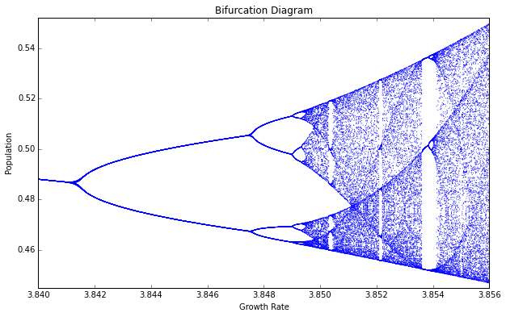](assets/chaos_theory/71b2c8c5f5f6ac3451de52514bbb99ea.png)

Incredibly, we see the exact same structure that we saw earlier at the macro-level. In fact, if we keep zooming infinitely in to this plot, we'll keep seeing the same structure and patterns at finer and finer scales, forever. How can this be?

I mentioned earlier that chaotic systems have _strange attractors_ and that their structure can be characterized as _fractal_. Fractals are [self-similar](https://en.wikipedia.org/wiki/Self-similarity), meaning that they have the same structure at every scale. As you zoom in on them, you find smaller copies of the larger macro-structure. Here, at this fine scale, you can see a tiny reiteration of the same bifurcations, chaos, and limit cycles we saw in the first bifurcation diagram of the full range of growth rates.

Another way to visualize this is with a [Poincare plot](http://geoffboeing.com/2015/04/visualizing-chaos-and-randomness/ "Visualizing Chaos and Randomness" ), which plots the population value at generation _t + 1_ on the y-axis versus the population value at _t_ on the x-axis. I delve into 2-D, 3-D, and animated Poincare plots in greater detail in a [subsequent post](http://geoffboeing.com/2015/04/visualizing-chaos-and-randomness/ "Visualizing Chaos and Randomness" ).

Remember that our model follows a simple deterministic rule, so if we know a certain generation's population value, we can easily determine the next generation's value:

[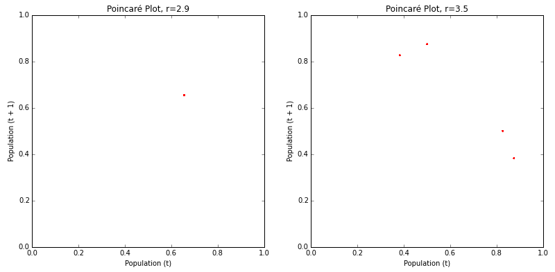](assets/chaos_theory/fa2f33dd1f45a28bcf9b1d8be6992451.png)

The Poincare plot above on the left shows that the logistic map homes in on a fixed-point attractor at 0.655 (on both axes) when the growth rate parameter is set to 2.9. This corresponds to the vertical slice above the x-axis value of 2.9 in the bifurcation diagrams shown earlier. The plot on the right shows a limit cycle attractor. When the growth rate is set to 3.5, the logistic map oscillates across four points, as shown in this Poincare plot (and in the bifurcation diagrams from earlier).

Here's what happens when these period-doubling bifurcations lead to chaos:

[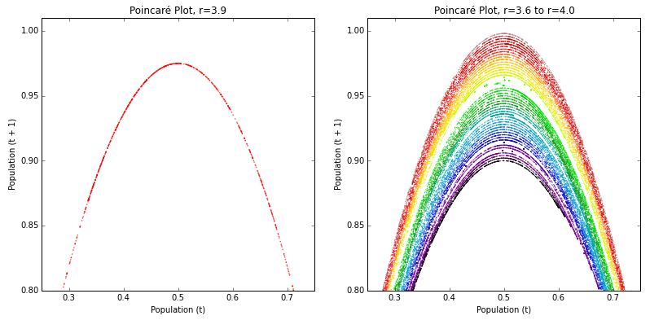](assets/chaos_theory/d88f4a8869c6479f4a31554af9c06c63.png)

The plot on the left depicts a parabola formed by a growth rate parameter of 3.9. The plot on the right depicts 50 different growth rate parameters between 3.6 and 4.0. This range of parameters represents the _chaotic regime_: the range of parameter values in which the logistic map behaves chaotically. Each growth rate forms its own curve. These parabolas never overlap, due to their fractal geometry and the deterministic nature of the logistic equation.

Strange attractors are revealed by these shapes: the system is somehow oddly constrained, yet never settles into a fixed point or a steady oscillation like it did in the earlier Poincare plots for r=2.9 and r=3.5. It just bounces around different population values, forever, without ever repeating a value twice.

## Chaos vs Randomness

These Poincare plots depict 2-dimensional [state space](http://geoffboeing.com/2015/04/visualizing-chaos-and-randomness/ "Visualizing Chaos and Randomness" ): an imaginary space that uses system variables as its dimensions. Each point in state space is a possible system state, or in other words, a set of variable values. Poincare plots are useful for revealing strange attractors in time series data (like that produced by the logistic map), because they embed this 1-dimensional data into a 2- or even 3-dimensional state space.

Indeed, it can be hard to tell if certain time series are chaotic or just random when you don't fully understand their underlying dynamics. Take these two as an example:

[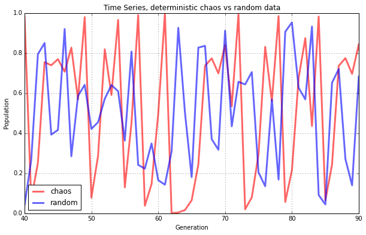](assets/chaos_theory/48a87367f44fa3be98911247e823ba02.png)

Both of the lines seem to jump around randomly. The blue line _does_ depict random data, but the red line comes from our logistic model when the growth rate is set to 3.99. This is deterministic chaos, but it's hard to differentiate it from randomness. So, let's visualize these same two data sets with Poincare plots instead of line charts:

[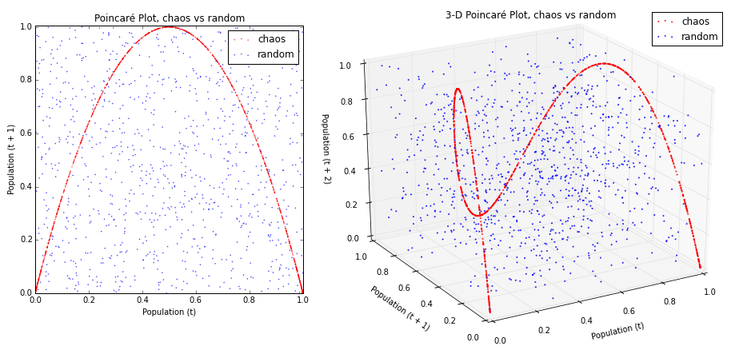](assets/chaos_theory/3cd0f699464806fd68ae3d6760668053.png)

Now we can see our chaotic system (in red, above) constrained by its strange attractor. In contrast, the random data (in blue, above) just looks like noise. This is even more compelling in the 3-D Poincare plot that embeds our time series into a 3-dimensional state space by depicting the population value at generation _t + 2 _vs the value at generation _t + 1_ vs the value at _t_.

Let's plot the rest of the logistic map's chaotic regime in 3-D. This is [an animated, 3-D](http://geoffboeing.com/2015/04/visualizing-chaos-and-randomness/ "Visualizing Chaos and Randomness" ) version of the 2-D rainbow parabolas we saw earlier:

In [three dimensions](http://geoffboeing.com/2015/04/visualizing-chaos-and-randomness/ "Visualizing Chaos and Randomness" ), the beautiful structure of the strange attractor is revealed as it twists and curls around its 3-D state space. This structure demonstrates that our _apparently_ random time series data from the logistic model isn't really random at all. Instead, it is aperiodic deterministic chaos, constrained by a mind-bending strange attractor.

## The Butterfly Effect

Chaotic systems are also characterized by their sensitive dependence on initial conditions. They don't have a basin of attraction that collects nearby points over time into a fixed-point or limit cycle attractor. Rather, with a strange attractor, close points _diverge_ over time.

This makes real-world modeling and prediction difficult, because you must measure the parameters and system state with infinite precision. Otherwise, tiny errors in measurement or rounding are compounded over time until the system is thrown drastically off. It was through one such [rounding error](http://www.technologyreview.com/article/422809/when-the-butterfly-effect-took-flight/) that Lorenz first discovered chaos. Recall his words at the beginning of this piece: "the present determines the future, but the approximate present does not approximately determine the future."

As an example of this, let's run the logistic model with two _very_ similar initial population values:

Both have the same growth rate parameter, 3.9. The blue line represents an initial population value of 0.5. The red line represents an initial population of 0.50001. These two initial conditions are _extremely_ similar to one another. Accordingly their results look essentially identical for the first 30 generations. After that, however, the minuscule difference in initial conditions starts to compound. By the 40th generation the two lines show little in common.

If our knowledge of these two systems started at generation 50, we would have no way of guessing that they were almost identical in the beginning. With chaos, history is lost to time and prediction of the future is only as accurate as your measurements. In real-world chaotic systems, measurements are never infinitely precise, so errors always compound, and the future becomes entirely unknowable given long enough time horizons.

This is famously known as the [butterfly effect](https://en.wikipedia.org/wiki/Butterfly_effect): a butterfly flaps its wings in China and sets off a tornado in Texas. Small events compound and irreversibly alter the future of the universe. In the line chart above, a tiny fluctuation of 0.00001 makes an enormous difference in the behavior and state of the system 50 generations later.

## The Implications of Chaos

Real-world chaotic and fractal systems include [leaky faucets](http://www.nature.com/news/2000/001222/full/news001228-2.html), [ferns](http://www.miqel.com/fractals_math_patterns/visual-math-natural-fractals.html), [heart rates](http://www.ncbi.nlm.nih.gov/pubmed/17593181), and [random number generators](https://www.random.org/randomness/). Many scholars have studied the implications of chaos theory for the [social](https://books.google.com/books) [sciences](http://www.hindawi.com/journals/ddns/1999/694059/abs/), [cities](http://www.amazon.com/Fractal-Cities-Geometry-Form-Function/dp/0124555705), and [urban](http://www.tandfonline.com/doi/abs/10.1080/01944369108975471) [planning](http://www.sciencedirect.com/science/article/pii/0960077994900663). Chaos fundamentally indicates that there are limits to knowledge and prediction. Some futures may be unknowable with any precision. Deterministic systems can produce wildly fluctuating and non-repeating behavior. Interventions into a system may have unpredictable outcomes even if they initially change things only slightly, as these effects compound over time.

During the 1990s, complexity theory grew out of chaos theory and largely supplanted it as an analytic frame for [social](http://press.princeton.edu/titles/8429.html) [systems](http://mitpress.mit.edu/books/cities-and-complexity). Complexity draws on similar principles but in the end is a very different beast. Instead of looking at simple, closed, deterministic systems, [complexity](http://geoffboeing.com/2014/10/urban-complexity-march-toward-qualifying-exams/ "Urban Complexity and the March Toward Qualifying Exams" ) [examines](http://geoffboeing.com/2015/01/the-inside-field-exam-and-urban-complexity/ "The Inside Field Exam and Urban Complexity" ) large open systems made of many interacting parts. Unlike chaotic systems, complex systems retain some trace of their initial conditions and previous states, through path dependence. They are unpredictable, but in a different way than chaos: complex systems have the ability to surprise through novelty and emergence. But that is a tale for another day.

I delve into 2-D, 3-D, and animated Poincare plots in greater detail in this [post](http://geoffboeing.com/2015/04/visualizing-chaos-and-randomness/ "Visualizing Chaos and Randomness" ), and I explain how to create animated 3-D data visualizations in Python in [this post](http://geoffboeing.com/2015/04/animated-3d-plots-python/ "Animated 3-D Plots in Python" ). All of the code that I used to run the model and produce these graphics is available in this [IPython notebook](http://nbviewer.ipython.org/github/gboeing/chaos-models/blob/master/chaos-logistic-model.ipynb). All of its functionality is thoroughly commented, but leave a note if you have any questions or suggestions. Feel free to play with it and explore the beauty of chaos.